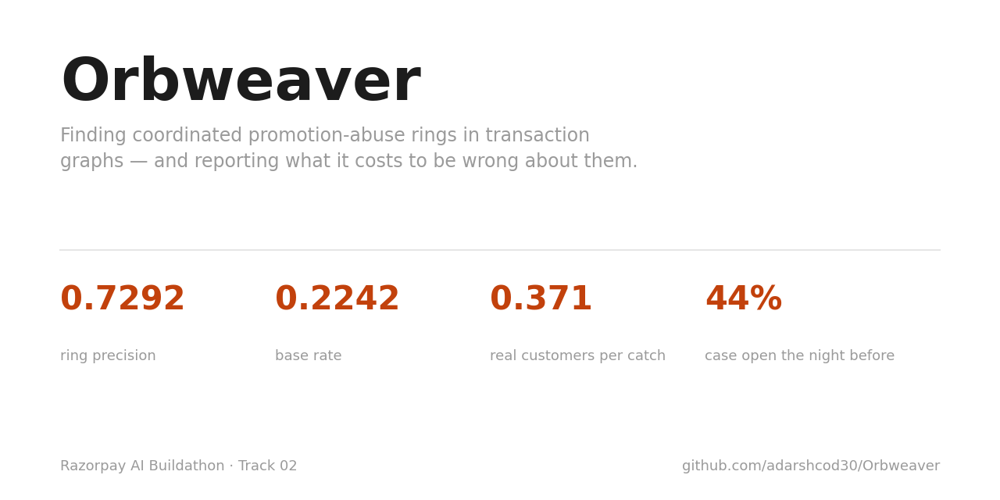
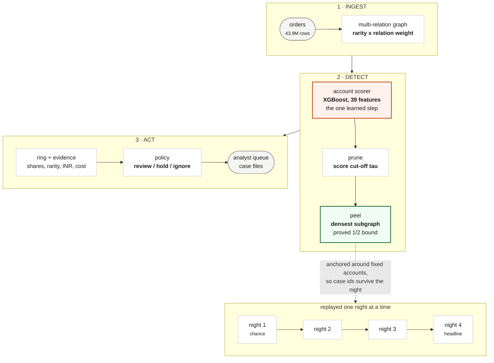
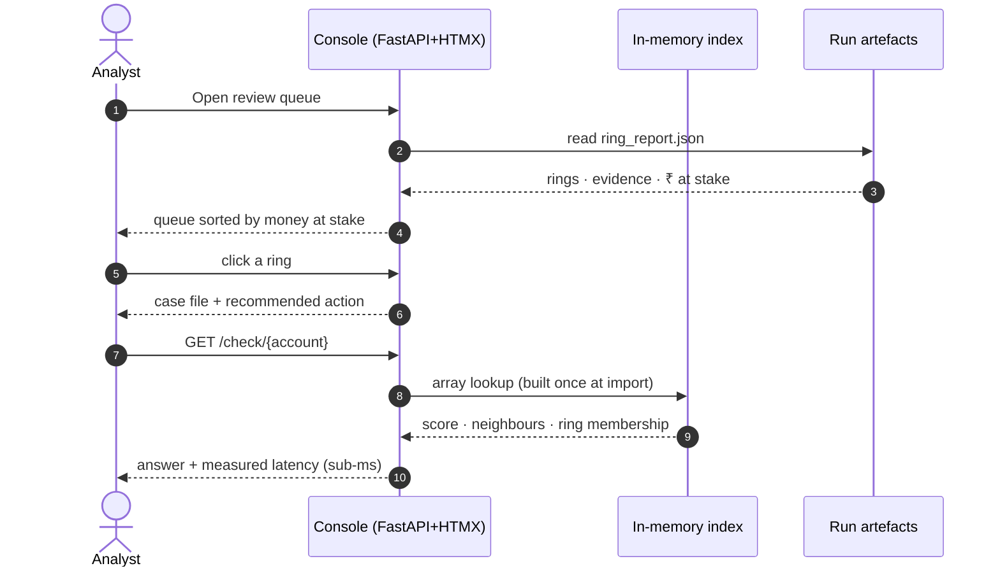
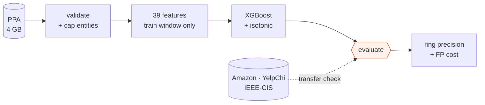

<div align="center">

# Orbweaver

### Coordinated promotion-abuse rings are invisible order by order. This finds them in the graph — and prices what it costs to be wrong.

[](https://github.com/adarshcod30/Orbweaver/actions/workflows/tests.yml)
[](https://orbweaver-adarshcod30s-projects.vercel.app)
[](https://adarshcod30.github.io/Orbweaver/)
[](LICENSE)
[](Makefile)
[](https://github.com/adarshcod30/Orbweaver/commits/main)

**[Live console](https://orbweaver-adarshcod30s-projects.vercel.app)** &nbsp;·&nbsp;
**[Docs site](https://adarshcod30.github.io/Orbweaver/)** &nbsp;·&nbsp;
**[All results](docs/results.md)** &nbsp;·&nbsp;
**[What broke](FAILURES.md)** &nbsp;·&nbsp;
**[Issues](https://github.com/adarshcod30/Orbweaver/issues)**



</div>

---

## In one minute

<!-- oneminute:start -->

A group running many accounts through one delivery-app promotion looks fine order by order; the fraud only exists in the connections between the accounts, which a detector scoring one transaction at a time cannot see. Pruning to suspicious accounts, then peeling for dense structure, catches them at **0.7292 ring precision** against a base rate of 0.2242 — **3.252× chance** — at a measured cost of **0.371 real customers swept into a ring for every fraudster it catches**.

**The finding I would defend hardest:** dense is not the same as fraudulent, and it replicates on every unrelated dataset I have tried it on. Unpruned, the same extractor lands *below* chance here (0.31×) and at *exactly zero* on YelpChi - 25 rings, 1,914 accounts, 0 of them fraudulent. Pruned first, the identical code reaches 14.3× on Amazon reviewers and 6.9× on YelpChi reviews - three platforms, two of them nothing like promotion abuse, saying the same thing ([why this matters](docs/why-this-data.md#how-amazon-yelpchi-and-ieee-cis-test-transfer)).

[**Live console**](https://orbweaver-adarshcod30s-projects.vercel.app) · [**Full results**](docs/results.md) · [**What broke**](FAILURES.md)


<!-- oneminute:end -->

---

**Contents** &nbsp;
[Overview](#overview) ·
[Features](#key-features) ·
[Stack](#tech-stack) ·
[Architecture](#system-architecture) ·
[Flow](#application-flow) ·
[Pipeline](#data--ml-pipeline) ·
[Results](#results) ·
[Caveats](#what-these-numbers-do-not-prove) ·
[ML boundary](#where-machine-learning-is-used-and-where-it-is-not) ·
[Failures](#what-broke) ·
[Deployment](#deployment--infrastructure) ·
[Structure](#project-structure) ·
[Start](#getting-started) ·
[API](#usage--api-reference) ·
[Tests](#testing) ·
[Roadmap](#roadmap) ·
[Research](#research-foundation)

---

## Overview

**The problem.** A delivery app gives ₹100 off your first order. A group runs
fifty accounts between them and takes ₹5,000. Every order looks normal on its
own — the fraud only exists in the *connections*: a shared address, a shared
device, one UPI ID paying for all of them.

**Why nothing on the shelf catches it.** Thirdwatch scores *"the probability of
the order being fraudulent"* — per order. Vulcan runs a transformer over ~3,000
signals — per transaction. A ring is invisible to both, because a ring is not a
property of any order. I checked rather than assumed: as of 2 September 2026,
every Sprint 2026 fraud launch is scoped to a transaction, a chargeback or an
identity. Nothing graph-level exists.

**The approach.** Score accounts once, prune to the suspicious region, then let
a densest-subgraph algorithm with a *proved bound* decide ring membership — so
"why is this account in this ring?" is checkable arithmetic, not a model's
opinion. Each ring ships as a case file with evidence, rupees at stake, and the
cost of being wrong.

**Keywords:** `fraud-detection` `graph-algorithms` `densest-subgraph`
`anomaly-detection` `payments` `fintech` `xgboost` `python` `reproducible-research`

## Key Features

| Feature | What it does |
|---|---|
| **Multi-relation graph** | Edges weighted by entity rarity × measured fraud lift, fitted on training accounts only |
| **Prune, then peel** | Score cut-off first, then greedy peeling with a ½-approximation bound |
| **Evidence per ring** | Shared entities, coverage, platform-wide rarity, day concentration, ₹ at stake |
| **Cost always attached** | Every precision number ships with real customers swept in per fraudster caught |
| **Capacity-aware policy** | Exact knapsack over reviewer minutes → review / auto-hold / ignore, with both numbers |
| **Anchored nightly replay** | Stable case ids so tonight's ring is recognisably tomorrow's case |
| **Live analyst console** | FastAPI + HTMX: queue, case files, offers, account lookup, replay. No build step |
| **Reproducible** | `make reproduce` regenerates every number, table and figure. Nothing typed by hand |
| **Honest failure log** | [36 dated entries](FAILURES.md) — what broke, what I believed, why it was wrong |

## Tech Stack

| Layer | Technology |
|---|---|
| Language | Python 3.11+ (developed on 3.13) |
| Graph & algorithms | `python-igraph`, NumPy · greedy peeling + Fast Belief Propagation, hand-written |
| ML | XGBoost (isotonic-calibrated) · GraphSAGE (reported alternative) · scikit-learn |
| Data | pandas, PyArrow/Parquet, pydantic-validated YAML config |
| Console | FastAPI + HTMX, server-rendered — no npm, no bundler |
| Reporting | Matplotlib; Markdown + HTML generated by `eval/report.py` |
| Testing / CI | pytest · GitHub Actions on every push |
| Hosting | Vercel (console) · GitHub Pages (docs & evidence) |

## System Architecture



1. **Build the graph** — accounts linked by shared entities, each edge weighted by how rare that entity is *and* how much that sharing predicts fraud.
2. **Score accounts** — gradient boosting over 39 engineered features. The one learned step in the pipeline.
3. **Prune, then peel** — the cut-off removes ordinary accounts; densest-subgraph decides membership on what remains.
4. **Attach evidence** — what they share, how rare, when they acted, rupees at stake, cost of being wrong.
5. **Price the response** — capacity-aware policy recommends an action under a stated reviewer budget.

→ Depth: [`docs/architecture.md`](docs/architecture.md) · [`docs/design-decisions.md`](docs/design-decisions.md)

## Application Flow



## Data & ML Pipeline



| Stage | What happens | Why it is done this way |
|---|---|---|
| **Sources** | PPA (only public labelled promotion-abuse *ring* dataset) + Amazon, YelpChi, IEEE-CIS as transfer checks | One dataset proves nothing about a method. [Why this data →](docs/why-this-data.md) |
| **Cleaning** | Schema validation; entity capping via `N_max`. **No relabelling, no augmentation, no dropped outliers** | A labelled evaluation is only worth something if the labels were set by someone with no stake in the result |
| **Features** | Graph edges as `alpha_r / log(2 + users(e))`; 39 account features | `alpha_r` is *measured* fraud–fraud lift per relation, fitted on training accounts only |
| **Training** | XGBoost + isotonic calibration. **Strictly temporal split** — week 1 trains, week 2 tests | Random node splits leak. `tests/test_split_no_leak.py` fails the build if one appears |
| **Alternatives** | GraphSAGE (mini-batch, CPU-deterministic) and Fast Belief Propagation, run at every label budget | Reported beside XGBoost whichever way they fall — and one of them wins |
| **Evaluation** | Ring precision vs base rate · FP cost · held-out AUPRC · hostel test · adversarial fragmentation | Precision alone is not a deployable number |

Measured file-by-file findings about the raw release: [`docs/data.md`](docs/data.md).

## Results

Regenerated by `make reproduce` — never typed by hand. Full detail with all 16
figures: **[docs/results.md](docs/results.md)**.

<!-- results:start -->

| | |
|---|---|
| Graph | 35,701,750 edges over the accounts active in the scoring window |
| Ring precision | **0.7292** against a base rate of 0.2242 — 3.252× |
| Cost of that | 0.371 real customers placed in a ring per fraudster caught |
| Without the score cut-off | 0.0696 — 0.31×, i.e. worse than picking at random |
| Account scorer | AUPRC 0.3796 on held-out accounts, 1.693× random |
| Three relations I cannot rebuild | worth +0.122 precision and +269 fraud accounts on the authors' own graph |
| Hostel test | 2 of 2,446 legitimate co-located groups touched (0.08%) |
| The relation only a platform can see | worth +0.024 to +0.038 ring precision at equal review capacity (250-500 accounts) |
| Time to detection, replaying night by night | median 4 of 4 nights; 33.4% of a ring's spend still ahead of it when it is found |
| Ranking rings by confidence | the mean member score wins at 200 rings (0.6739) — a trained ring model gets 0.5989, density 0.5814 |
| Yesterday's rings as a feature | +0.0011 AUPRC — it reaches 0.15% of held-out accounts. `/check` answers in 0.01 ms at the median |
| Behaviour edges against fragmentation | +0.0237 ring precision when the ring is split into threes, -0.0023 when it is split into twenties |
| The same method on a payment processor's graph | 0.5079 precision, 18.138× its base rate, at 0.969 good cards per fraudulent one caught |
| What one analyst an hour a night stops | ₹67,900 of promotion value against ₹200 for working the queue in order, for ₹16,040 of legitimate value harmed (assumed rupees) |
| Telling a crowd from a ring by when it formed | burst-weighted ring precision -0.0149 on PPA; on IEEE-CIS the apartment-cluster weakness is unchanged at 4 of 7 touched at every resolution tried |
| Which offers are being farmed | top 50 offers by size (325,494 accounts) cover 7.1% of all labelled fraud, 19.7x the 0.36% ring recall ceiling |
| How many confirmed cases before this works | prune-then-peel first beats the base rate at 1,146 confirmed accounts (0.5% of the training pool) |
| Spreading what few labels there are | Fast Belief Propagation, no fitted model: 0.4615 held-out AUPRC at full labels, 0.9886 ring precision pruning on its beliefs alone |
| A ring you can find again tomorrow | 44% of final rings had a case open the night before (global peeling: 4%); 0.7167 precision against 0.7292 for the cost of a case id |

<!-- results:end -->

### The thirteen investigations — including the four that did not work

| # | Finding | Outcome |
|---|---|---|
| 1 | **Dense is not the same as fraudulent.** On the raw graph the densest subgraphs are large ordinary communities — people who happened to use the same promotion — and ring precision comes out *below* the base rate. Filtering to suspicious accounts first, then looking for dense structure inside that region, is what makes the output useful. It replicates on two unrelated datasets: run unchanged on Amazon reviewers and YelpChi reviews, the unpruned extractor again lands below base rate — on YelpChi at *exactly zero*, 25 rings and 1,914 accounts without a single fraudster — while pruning first reaches 14.3× and 6.9× | Held up — the one I would defend hardest |
| 2 | **The relation that dominates the graph carries the weakest signal.** Promotion edges are 70% of the graph at 1.76× fraud lift; location edges are 16% at 3.71×. Weighting relations by measured evidential value, fitted on training accounts only, follows directly | Held up — drives the edge weighting |
| 3 | **The link only a platform can see is worth measuring, not assuming.** On YelpChi, removing the one relation that spans businesses costs two to four points of ring precision at equal review capacity. I had argued the aggregator's advantage with simulated edges before this; now it is a measurement on real labels, and the simulated version is only a sensitivity check | Held up — a measurement replaced a guess |
| 4 | **One night of data is worth nothing, and rings do not survive the night.** Replaying a night at a time, a single night puts the queue at chance, and it takes four nights to reach the headline. Worse, no ring found on the last night had a recognisable predecessor — a case could not be tracked at all. **Anchoring the extraction fixed it**: 44% of final rings now have a case open the night before against 0% for the global extractor, at a cost of 0.0125 precision | Failed, then fixed by anchoring |
| 5 | **The crudest baseline beat the model I built to replace it.** A ring-level confidence model lost to simply ranking by the mean score of a ring's members, at every depth. The reason is visible in the training data: 90.6% of candidate rings are already fraudulent, so there is almost nothing for a ring-level model to separate | Negative result |
| 6 | **Ring history does not transfer to the next window.** Feeding "was this account in a ring last window" back into the account score moves held-out AUPRC by +0.0011. The ceiling was set before the model ran: the feature is non-zero for 0.15% of held-out accounts. Rings are window-specific objects — the accounts recur, the groupings do not | Negative result |
| 7 | **Behaviour edges raise the price of fragmentation without defeating it.** Splitting a ring into cells of three takes precision from 0.73 to 0.45. Mutual nearest-neighbour edges in behaviour space — which an attacker cannot cut by severing shared entities — recover +0.0237 of that, and nothing at all at cells of twenty | Partial — fragmentation still works |
| 8 | **The method transfers to a payment processor's graph, and its weakest point moves with it.** On IEEE-CIS the same pipeline reaches 0.5079 ring precision at 18.1× base rate. But the apartment-building analogue of the hostel test touches 4 of 7 clusters, against 2 of 2,446 here, because the billing address is at once the most informative relation and the thing that legitimately ties every card in a building together | Transfers, at a cost |
| 9 | **The analyst is not the bottleneck I built for.** Pricing review against auto-hold under a fixed budget, the fraud stopped does not change between thirty analyst-minutes a night and two hundred and forty — auto-holding already stops it. What analyst time buys is a 39% fall in legitimate value harmed. On these assumptions the reviewer is a false-positive control rather than a detector | Held up — not what I expected |
| 10 | **Telling a crowd from a ring by when it formed did not pay off, and the fair test explains why.** Burstiness weighting costs 0.0149 precision on PPA with no clean per-relation story. IEEE-CIS was built to test this properly, with second-resolution timestamps PPA cannot offer, and returned as clean a null as this project has produced: the same 4 of 7 apartment clusters at *every* resolution from one hour to one day. The billing address is not informative *despite* being shared by a legitimate building — it is informative *because of it* | Negative result — a clean null |
| 11 | **Which offers are farmed splits into a precision ranking and a coverage ranking — and they are not the same offers.** A leakage score built from no label beats base rate by 2.5–3.8× at top 25 and 50. But leakage ranks small, concentrated offers first, capping how much fraud it can touch: fifty offers by leakage cover 0.04% of labelled fraud, against 7.1% — 19.7× the ring's own recall ceiling — ranked by raw size, at the cost of reviewing 325,494 accounts rather than a few hundred | Held up — a capacity decision, not a technical one |
| 12 | **A team with almost no confirmed labels is not starting from nothing.** Prune-then-peel already beats base rate at the smallest fraction tested — 1,146 confirmed accounts, 0.5% of the training pool. Held-out AUPRC keeps climbing all the way to 100%; no plateau appears in the range tested | Held up |
| 13 | **A method with no fitted model at all beat both learned scorers, and not for the reason I expected.** Fast Belief Propagation — one sparse linear system, a proven convergence condition, priors from confirmed labels only — reaches 0.4615 held-out AUPRC against XGBoost's 0.3796 and GraphSAGE's 0.3819, and pruning on its beliefs alone lifts ring precision to 0.9886 with three times the recall at the same review cost. The hypothesis was that propagation wins when labels are *scarce*; the data says the opposite — it trails both learned scorers from 0.5% through 20% of the pool and only crosses over at 50%. Propagation needs seeds to spread from | Held up — hypothesis wrong, result right |

Every one of these is written up in full, with the figure that produced it, in
**[docs/results.md](docs/results.md)**.

## What These Numbers Do Not Prove

| Limit | Detail |
|---|---|
| **Not Indian data** | PPA is Chinese food delivery. The method is data-agnostic; the numbers are not. The hostel test is the closest proxy — real validation needs Indian data |
| **Transfer runs are weaker** | Amazon/YelpChi ship no timestamps (account-disjoint, not forward in time) and *do* ship node features PPA lacks — their higher numbers say more about the datasets |
| **The release ≠ the paper** | Test week only: 3,267,961 accounts, 10,012,449 edges — not 5.69M/29M. Three of eight relations are empty in the order files. [Measured here](docs/data.md) |
| **₹ rests on assumptions** | PPA ships no monetary amounts. The ₹ columns rank options against each other; they mean nothing absolute |
| **Ring recall is low by design** | Rings surface a few hundred accounts for review, not the population. A queue asks what share of what it looks at is worth looking at |
| **Baselines aren't like-for-like** | Published baselines have no account holdout and count unlabelled as negative. Both conventions are reported |

## Where Machine Learning Is Used, and Where It Is Not

| Stage | Learned? |
|---|---|
| Graph construction, edge weighting | No — arithmetic over measured per-relation lift |
| **Account scoring** | **Yes — XGBoost, the only learned component** |
| Ring extraction | No — deterministic peeling with a proved bound |
| Evidence, ₹ at stake, FP cost | No — counting and stated arithmetic |
| The decision to act | No — a human reads the case file |

A model scores accounts. It does **not** decide who is in a ring. No language
model sits anywhere in the detection or decision path.
→ [`docs/design-decisions.md`](docs/design-decisions.md)

## What Broke

**[FAILURES.md](FAILURES.md)** — 36 dated entries, [the five that mattered](FAILURES.md#the-five-that-mattered)
linked at the top. The one I'd point at: I trained a model on **183,370
accounts that did not exist**, because the two order files are independently
re-indexed and I joined week-1 behaviour to week-2 labels through an id that
means nothing across the boundary. It trained cleanly. It converged. All 27
features had a fraud/normal ratio of exactly 1.000 — that's what gave it away.

## Deployment & Infrastructure

| Concern | How it works |
|---|---|
| **Console** | [Vercel](https://orbweaver-adarshcod30s-projects.vercel.app), serverless Python. `api/index.py` re-exports the FastAPI app; `vercel.json` installs `requirements-demo.txt` (6 packages) and ships `demo/**` |
| **Docs** | [GitHub Pages](https://adarshcod30.github.io/Orbweaver/) from `docs/` with `.nojekyll`. Every page there is generated by `make report` |
| **CI** | GitHub Actions runs the data-free suite on every push to `main` (badge above) |
| **Deploys** | Both surfaces redeploy on push to `main`. No manual step |
| **Demo mode** | Console serves the committed `demo/` bundle whenever `data/processed/` is empty — a clone with no dataset still runs. `/health` reports mode, rings served, bundle size |
| **Determinism** | Fixed seeds in `config/default.yaml`; the GNN trains on CPU because Metal's scatter reductions are non-deterministic |

## Project Structure

```
Orbweaver/
├── orbweaver/          # the package
│   ├── data/           # loaders: PPA, GADBench, IEEE-CIS · subsampling · lockstep
│   ├── features/       # 39 account features · ring context
│   ├── scoring/        # XGBoost · GraphSAGE · sampler · Fast Belief Propagation
│   ├── rings/          # peeling · anchored extraction · ring scorer · review policy
│   ├── adversarial/    # fragmentation · duplication · behavioural twins
│   └── console/        # FastAPI + HTMX console, demo-bundle mode
├── eval/               # one investigation per script, one JSON artefact each
├── tests/              # temporal-split + planted-ring tests gate every number
├── config/default.yaml # every threshold, seed and cost assumption
├── scripts/            # dataset download · demo smoke test · prose voice check
├── docs/               # generated results, figures, published site
├── demo/               # the ≤2 MB bundle console and Pages run from
└── api/                # Vercel entrypoint
```

| Doc | Read it if… |
|---|---|
| [`docs/results.md`](docs/results.md) | You want every number and all 16 figures |
| [`docs/why-this-data.md`](docs/why-this-data.md) | You're asking "why this dataset, and is it trustworthy" |
| [`docs/architecture.md`](docs/architecture.md) | You want the five stages in depth |
| [`docs/design-decisions.md`](docs/design-decisions.md) | You want the ML boundary, and why it sits there |
| [`docs/data.md`](docs/data.md) | You want the raw release measured file by file |
| [`docs/threat-model.md`](docs/threat-model.md) | You want what it catches, misses, and how to evade it |
| [`FAILURES.md`](FAILURES.md) | You want the honest log. Start here |
| [`ETHICS.md`](ETHICS.md) | You want the scope boundary in six lines |

## Getting Started

**Option A — the console, no dataset needed** (about a minute):

```bash
git clone https://github.com/adarshcod30/Orbweaver.git
cd Orbweaver
pip install -r requirements-demo.txt
make console          # → http://127.0.0.1:8000
```

It detects that `data/processed/` is empty and serves the committed `demo/`
bundle: real rings, real evidence, real numbers from a full run.

**Option B — reproduce everything from raw data:**

```bash
make setup            # full dependencies
make download         # PPA from OSF, ~4 GB, resumable + md5-verified
make reproduce        # every stage, end to end
```

`make reproduce-core` runs the pipeline alone in ~50 minutes. Every stage is
its own target (`make graph`, `make score`, `make rings`, `make policy`,
`make replay`) writing JSON into `data/processed/`.

## Usage & API Reference

| Method | Route | Returns |
|---|---|---|
| `GET` | `/` | Review queue, filterable by shared relation and known-fraud count |
| `GET` | `/ring/{rank}` | One ring's case file — members, shared entities, rarity, ₹ at stake |
| `GET` | `/offers` | Which promotions are farmed, ranked by a leakage score that uses no label |
| `GET` | `/replay` | The window replayed night by night — precision, persistence, ₹ stopped |
| `GET` | `/findings` | Every figure with a plain-language caption |
| `GET` | `/check/{account}` | JSON: everything known about one account + measured latency |
| `GET` | `/health` | Mode (demo/full), rings served, bundle size |

```bash
curl -s https://orbweaver-adarshcod30s-projects.vercel.app/check/291571 | python3 -m json.tool
```

## Testing

```bash
make test    # the suite
make check   # the suite + the prose check this repo is held to
```

The tests that matter aren't the unit tests: `tests/test_split_no_leak.py`
fails the build if any week-2 account appears in training, and the planted-ring
tests assert the extractor recovers a ring deliberately inserted into a
synthetic graph — so a silent regression in the peeling objective can't pass.

## Roadmap

- [ ] Validate on Indian payments data — the one thing the hostel test can't substitute for
- [ ] A shared payment-instrument relation across merchants — the edge no single platform can build
- [ ] Streaming extraction instead of nightly batch, so a case opens the hour it forms
- [ ] Reviewer feedback as a label source, closing the loop between queue and scorer
- [ ] Seller collusion and refund rings — same algorithm, different labels ([threat model](docs/threat-model.md))

## Research Foundation

| Work | What it contributed here |
|---|---|
| **PromoGuardian / PPA**, IEEE S&P 2026 · [arXiv](https://arxiv.org/abs/2510.12652) · [data](https://osf.io/rasje/?view_only=671050154acf4c0fa6b86a9337e74c2c) | The labelled dataset everything is measured against. No code or checkpoint reused |
| Charikar, APPROX 2000 | The ½-approximation the peeling objective relies on |
| Hooi et al., **FRAUDAR**, KDD 2016 | Camouflage-resistant weighting; the bound for the node-prior objective |
| Bahmani, Kumar & Vassilvitskii, VLDB 2012 | Batch peeling — how rings get extracted at 35.7M-edge scale |
| Khuller & Saha, ICALP 2009 | The NP-hardness result motivating approximation over exact search |
| Xu, Ma, Fang et al., SIGMOD 2023 | The empirical bound cited for greedy peeling under a size ceiling |
| Dai et al., **Anchored Densest Subgraph**, SIGMOD 2022 | The anchored formulation that makes a case survive the night |
| Greene, Doyle & Cunningham, ASONAM 2010 | Life-cycle events and the Jaccard threshold for case identity |
| Koutra et al., ECML-PKDD 2011 | **Fast Belief Propagation**, implemented as specified — and it beat the learned scorer |
| Beutel et al., **CopyCatch**, WWW 2013 | The lockstep-in-time argument the burstiness arm tests |
| Tang et al., **GADBench**, NeurIPS 2023 | Why this starts with gradient boosting; two of the transfer datasets |
| Dou et al., **CARE-GNN**, CIKM 2020 | The Amazon and YelpChi releases used unchanged as a transfer check |
| Razorpay, [Thirdwatch](https://razorpay.com/blog/detect-fraud-using-ml-ai-thirdwatch/) | The per-order framing this complements rather than replaces |

## Contributing

Personal research project — not looking for feature contributions, but
corrections are genuinely welcome, especially *a number you cannot reproduce*.
Open an [issue](https://github.com/adarshcod30/Orbweaver/issues) with the
command you ran and what you got. Building on it: fork → branch → `make check`
→ PR describing which numbers moved.

## License & Ethics

MIT — [LICENSE](LICENSE). Detection only. **[ETHICS.md](ETHICS.md)** sets the
boundary in six lines: no attack tooling, public research data only, case files
rather than automated verdicts, false-positive cost next to every detection
number, simulated edges always labelled simulated, and shared attributes as
evidence for a human to weigh — never as guilt.

Cite with [`CITATION.cff`](CITATION.cff).

## Contact

**Adarsh Dwivedi** — [23ucs509@lnmiit.ac.in](mailto:23ucs509@lnmiit.ac.in) ·
[GitHub](https://github.com/adarshcod30)

<div align="center">

[Live console](https://orbweaver-adarshcod30s-projects.vercel.app) ·
[Docs](https://adarshcod30.github.io/Orbweaver/) ·
[Results](docs/results.md) ·
[Failures](FAILURES.md)

Built for the **Razorpay AI Buildathon, Track 02**.

</div>
