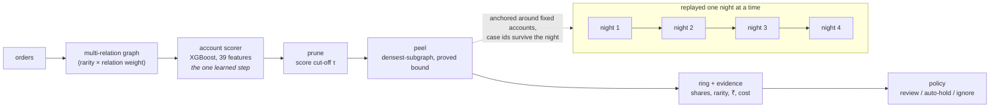

# Orbweaver

*The one that feels the whole web.*

Finding coordinated promotion-abuse rings in transaction graphs — and reporting
what it costs to be wrong about them.

[](https://github.com/adarshcod30/Orbweaver/actions/workflows/tests.yml)
[](LICENSE)
[](https://orbweaver-adarshcod30s-projects.vercel.app)
[](https://adarshcod30.github.io/Orbweaver/)

## In one minute

<!-- oneminute:start -->

A group running many accounts through one delivery-app promotion looks fine order by order; the fraud only exists in the connections between the accounts, which a detector scoring one transaction at a time cannot see. Pruning to suspicious accounts, then peeling for dense structure, catches them at **0.7292 ring precision** against a base rate of 0.2242 — **3.252× chance** — at a measured cost of **0.371 real customers swept into a ring for every fraudster it catches**.

**The finding I would defend hardest:** dense is not the same as fraudulent, and it replicates on every unrelated dataset I have tried it on. Unpruned, the same extractor lands *below* chance here (0.31×) and at *exactly zero* on YelpChi - 25 rings, 1,914 accounts, 0 of them fraudulent. Pruned first, the identical code reaches 14.3× on Amazon reviewers and 6.9× on YelpChi reviews - three platforms, two of them nothing like promotion abuse, saying the same thing ([why this matters](docs/why-this-data.md#transfer)).

[**Live console**](https://orbweaver-adarshcod30s-projects.vercel.app) · [**Full results**](docs/results.md) · [**What broke**](FAILURES.md)


<!-- oneminute:end -->

**Why this dataset, and why it was never touched:** [docs/why-this-data.md](docs/why-this-data.md).
**Every doc in this repository, one line each:** [docs/README.md](docs/README.md).

---

## The problem

A food-delivery app gives ₹100 off your first order. A group runs fifty
accounts between them — a few people, a few phones, a stack of SIMs registered
in other people's names — and takes ₹5,000. Every order looks normal on its
own; the fraud only exists in the connections between accounts: a shared
delivery address, a shared device, the same UPI ID paying for all of them,
orders placed close together. A system that scores one transaction at a time
cannot see it.

That is the gap. Razorpay's Thirdwatch scores *"the probability of the order
being fraudulent"* — per order. Vulcan runs a transformer over roughly 3,000
signals — per transaction. Both are good at what they do, and a ring is
invisible to both, because a ring is not a property of any order. It is a
property of the graph between them.

I checked this rather than assuming it. As of 2 September 2026, Sprint 2026's
fraud and risk launches are chargeback protection, AML risk screening, an RTO
shielder, a dispute auto-responder and biometric card authentication — every
one of them scoped to a transaction, a chargeback or an identity. The closest
thing to this work is the AML screening, since money-laundering detection is
where graph methods usually appear, but it is described as predicting risk
early rather than as network analysis. Nothing ring-, group- or graph-level
appears anywhere.

Orbweaver sits downstream of a per-order scorer and looks at the web instead of
the strand.

## How it works

Five stages, run over a finished week for the headline numbers and one night
at a time for the replay: one night of data puts the queue at chance, and it
takes four to reach the number below. `docs/architecture.md` walks through
every stage; `docs/design-decisions.md` explains the one place a model is
allowed to touch the outcome.



1. **Builds a graph** of accounts linked by the entities they share, with each
   edge weighted by how rare that entity is *and* how much that kind of sharing
   actually predicts fraud.
2. **Scores accounts** with gradient boosting over 39 engineered features —
   the one learned step in the whole pipeline.
3. **Prunes, then peels.** A score cut-off removes ordinary accounts first;
   a densest-subgraph algorithm with a proved approximation bound decides ring
   membership on what is left, so every membership decision is inspectable —
   not a model's opinion.
4. **Attaches evidence** to each ring: what the members share, how rare it is,
   when they acted, the rupees at stake, and the cost of being wrong.
5. **Prices the response.** A capacity-aware policy recommends review,
   auto-hold or ignore under a stated reviewer budget, with the two numbers
   that justify it on every case card.

## Results

All numbers, tables and figures live in **[docs/results.md](docs/results.md)**
and are regenerated by `make reproduce`. Nothing in this repository is typed in
by hand — including the table below, which is rewritten from the run artefacts
every time.

<!-- results:start -->

| | |
|---|---|
| Graph | 35,701,750 edges over the accounts active in the scoring window |
| Ring precision | **0.7292** against a base rate of 0.2242 — 3.252× |
| Cost of that | 0.371 real customers placed in a ring per fraudster caught |
| Without the score cut-off | 0.0696 — 0.31×, i.e. worse than picking at random |
| Account scorer | AUPRC 0.3796 on held-out accounts, 1.693× random |
| Three relations I cannot rebuild | worth +0.122 precision and +269 fraud accounts on the authors' own graph |
| Hostel test | 2 of 2,446 legitimate co-located groups touched (0.08%) |
| The relation only a platform can see | worth +0.024 to +0.038 ring precision at equal review capacity (250-500 accounts) |
| Time to detection, replaying night by night | median 4 of 4 nights; 33.4% of a ring's spend still ahead of it when it is found |
| Ranking rings by confidence | the mean member score wins at 200 rings (0.6739) — a trained ring model gets 0.5989, density 0.5814 |
| Yesterday's rings as a feature | +0.0011 AUPRC — it reaches 0.15% of held-out accounts. `/check` answers in 0.01 ms at the median |
| Behaviour edges against fragmentation | +0.0237 ring precision when the ring is split into threes, -0.0023 when it is split into twenties |
| The same method on a payment processor's graph | 0.5079 precision, 18.138× its base rate, at 0.969 good cards per fraudulent one caught |
| What one analyst an hour a night stops | ₹67,900 of promotion value against ₹200 for working the queue in order, for ₹16,040 of legitimate value harmed (assumed rupees) |
| Telling a crowd from a ring by when it formed | burst-weighted ring precision -0.0149 on PPA; on IEEE-CIS the apartment-cluster weakness is unchanged at 4 of 7 touched at every resolution tried |
| Which offers are being farmed | top 50 offers by size (325,494 accounts) cover 7.1% of all labelled fraud, 19.7x the 0.36% ring recall ceiling |
| How many confirmed cases before this works | prune-then-peel first beats the base rate at 1,146 confirmed accounts (0.5% of the training pool) |
| Spreading what few labels there are | Fast Belief Propagation, no fitted model: 0.4615 held-out AUPRC at full labels, 0.9886 ring precision pruning on its beliefs alone |
| A ring you can find again tomorrow | 44% of final rings had a case open the night before (global peeling: 4%); 0.7167 precision against 0.7292 for the cost of a case id |

<!-- results:end -->

The thirteen findings, including the four that did not work:

1. **Dense is not the same as fraudulent.** On the raw graph the densest
   subgraphs are large ordinary communities — people who happened to use the
   same promotion — and ring precision comes out *below* the base rate.
   Filtering to suspicious accounts first, then looking for dense structure
   inside that region, is what makes the output useful. That ordering is the
   single most important thing I learned building this, and it replicates on
   two unrelated datasets: run unchanged on Amazon reviewers and YelpChi
   reviews, the unpruned extractor again lands below the base rate — on
   YelpChi at *exactly zero*, 25 rings and 1,914 accounts without a single
   fraudster — while pruning first reaches 14.3× and 6.9×.
2. **The relation that dominates the graph carries the weakest signal.**
   Promotion edges are 70% of the graph at 1.76× fraud lift; location edges are
   16% at 3.71×. Weighting relations by measured evidential value, fitted on
   training accounts only, follows directly.
3. **The link only a platform can see is worth measuring, not assuming.** On
   YelpChi, removing the one relation that spans businesses costs two to four
   points of ring precision at equal review capacity. I had argued the
   aggregator's advantage with simulated edges before this; now it is a
   measurement on real labels, and the simulated version is a sensitivity
   check.
4. **One night of data is worth nothing, and rings do not survive the night.**
   Replaying the window a night at a time, a single night puts the queue at the
   base rate — chance — and it takes four nights to reach the headline number.
   Worse, no ring found on the last night had a recognisable predecessor, so a
   case could not be tracked at all. **Anchoring the extraction fixed that**:
   44% of the final rings now have a case open the night before against 0% for
   the global extractor, at a cost of 0.0125 precision.
5. **The crudest baseline beat the model I built to replace it.** A ring-level
   confidence model lost to simply ranking by the mean score of a ring's
   members, at every depth. The reason is visible in the training data: 90.6%
   of the candidate rings are already fraudulent, so there is almost nothing
   for a ring-level model to separate.
6. **Ring history does not transfer to the next window.** Feeding "was this
   account in a ring last window" back into the account score moves held-out
   AUPRC by +0.0011. The ceiling was set before the model ran: the feature is
   non-zero for 0.15% of held-out accounts. Rings are window-specific objects —
   the accounts recur, the groupings do not.
7. **Behaviour edges raise the price of fragmentation without defeating it.**
   Splitting a ring into cells of three takes precision from 0.73 to 0.45.
   Mutual nearest-neighbour edges in behaviour space — which an attacker cannot
   cut by severing shared entities — recover +0.0237 of that, and nothing at
   all at cells of twenty. Fragmentation remains the attack that works.
8. **The method transfers to a payment processor's graph, and its weakest point
   moves with it.** On IEEE-CIS the same pipeline reaches 0.5079 ring precision
   at 18.1× the base rate. But the apartment-building analogue of the hostel
   test touches 4 of 7 clusters, against 2 of 2,446 here, because the billing
   address is at once the most informative relation and the thing that
   legitimately ties every card in a building together.
9. **The analyst is not the bottleneck I built for.** Pricing review against
   auto-hold under a fixed budget, the fraud stopped does not change between
   thirty analyst-minutes a night and two hundred and forty — auto-holding
   already stops it. What analyst time buys is a 39% fall in legitimate value
   harmed. On these assumptions the reviewer is a false-positive control rather
   than a detector, which is not what I expected.
10. **Telling a crowd from a ring by when it formed did not pay off, and the
    fair test explains why.** Weighting edges by entity-arrival burstiness
    costs 0.0149 ring precision on PPA, with no clean per-relation story — one
    relation's least-bursty quartile carries the highest fraud lift, another's
    the opposite. IEEE-CIS was built to test this properly, with
    second-resolution timestamps PPA cannot offer, and it returned as clean a
    null as this project has produced: the same 4 of 7 apartment clusters
    touched at every resolution from one hour to one day. The billing address
    is not informative *despite* being shared by a legitimate building — it is
    informative *because of it* — and no reweighting of the same edges changes
    which edges those are.
11. **Which offers are being farmed splits into a precision ranking and a
    coverage ranking, and they are not the same offers.** A leakage score
    built from no label — ring share and mean member score — beats the base
    rate by 2.5–3.8× at top 25 and 50. But leakage ranks small, concentrated
    offers first, which caps how much fraud they can ever touch: fifty offers
    by leakage cover 0.04% of all labelled fraud, against 7.1% — 19.7× the
    ring's own recall ceiling — ranked by raw size instead, at the cost of
    reviewing 325,494 accounts rather than a few hundred. Which ranking to use
    is a review-capacity decision, not a technical one.
12. **A team with almost no confirmed fraud labels is not starting from
    nothing.** Prune-then-peel already beats the base rate at the smallest
    fraction tested — 1,146 confirmed accounts, 0.5% of the training pool.
    Held-out AUPRC keeps climbing meaningfully all the way to 100% of the
    pool; no plateau appears within the range tested, so more labels would
    plausibly still help past where this sweep stops.
13. **A method with no fitted model at all beat both learned scorers, and the
    reason it does is not the reason I expected.** Fast Belief Propagation —
    one sparse linear system, a proven convergence condition, priors from
    confirmed labels only — reaches 0.4615 held-out AUPRC at full label
    availability against XGBoost's 0.3796 and GraphSAGE's 0.3819, and pruning
    on its beliefs alone lifts ring precision to 0.9886 with three times the
    recall at the same review cost. The hypothesis going in was that
    propagation wins when labels are scarce; the data says the opposite — it
    trails both learned scorers from 0.5% through 20% of the training pool and
    only crosses over at 50%. Propagation needs seeds to spread from, and
    needs enough of them before it out-reaches a feature model that has no
    such blind spot.

## What these numbers do not prove

- **PPA is Chinese food-delivery data.** The method is data-agnostic; the
  numbers are not Indian. The hostel test is the closest I can get to the
  most India-specific failure mode, and real validation needs Indian data. The
  Amazon and YelpChi runs show the method transfers, but those are US review
  fraud, not Indian payments. [docs/why-this-data.md](docs/why-this-data.md)
  makes the full case for why this is still the right dataset to have started
  from.
- **The generalisation runs are a weaker test than the PPA one.** Amazon and
  YelpChi ship no timestamps, so that split is account-disjoint but not forward
  in time. They are also easier problems — both have real node features, which
  PPA does not — so their much higher numbers say more about what those
  datasets give you than about the method.
- **The released dataset is not the one in the paper.** It is the test week
  only — 3,267,961 accounts and 10,012,449 edges, not 5.69M and 29M — and
  three of its eight relation types have no values at all in the order files.
  Every number here is against what is actually downloadable. See
  `docs/data.md`.
- **The rupee figures rest on stated assumptions.** PPA ships no monetary
  amounts whatsoever. The ₹ columns are counts multiplied by an assumed value,
  labelled as such in the output itself, and they rank operating points against
  each other rather than meaning anything absolute.
- **Ring recall is low by construction.** Rings surface a few hundred accounts
  for human review, not the whole population. The question a review queue asks
  is what share of what it looks at is worth looking at.
- **No account holdout exists in the published baselines**, and they count
  unlabelled accounts as negatives. Comparisons to them are only like-for-like
  in the convention that does the same, and `docs/results.md` reports both.

## Where machine learning is used, and where it is not

One learned component: the account scorer. Ring membership is decided by a
deterministic objective with an approximation bound, so "why is this account in
this ring?" has an answer a person can check by hand. A second, deliberately
provable method — Fast Belief Propagation — is reported beside it and, on this
graph, beats it; neither is on the critical path in place of the other.

No language model is anywhere in the detection or decision path.
**[docs/design-decisions.md](docs/design-decisions.md)** explains the reasoning.

## What broke

**[FAILURES.md](FAILURES.md)** is the honest log, written as things happened —
thirty-six entries, [the five that mattered](FAILURES.md#the-five-that-mattered)
linked at the top. The one I would point at here: I trained a model on 183,370
accounts that did not exist, because the two order files are independently
re-indexed and I had joined week-1 behaviour to week-2 labels through an id
that means nothing across the boundary. It trained cleanly. It converged.
Every one of 27 features had a fraud/normal ratio of 1.000, which is what gave
it away.

## Running it

```bash
make setup       # dependencies
make download    # PPA from OSF, ~4 GB, resumable and md5-verified
make reproduce   # everything, end to end
```

`make reproduce-core` runs the pipeline alone in about fifty minutes if you do
not want the extra investigations. `make test` runs the suite, including the
temporal-split and planted-ring tests that gate every number. `make check` runs
the suite plus the voice check this repository's prose is held to.

To look at the output rather than the numbers:

```bash
make console     # review queue at http://127.0.0.1:8000
```

**Without downloading anything.** The repository carries a bundle of
already-computed results (`demo/`, kept under 2 MB), and the console serves it
whenever `data/processed` is empty — so a clone, six packages and one command
is the whole setup:

```bash
pip install -r requirements-demo.txt && make console
```

The same bundle runs the [live console](https://orbweaver-adarshcod30s-projects.vercel.app)
on Vercel. The pages say which mode they are in: in bundle mode `/check`
returns stored neighbour counts rather than computing a ring around an account
live, because 35.7 million edges do not belong in something meant to be
cloned.

FastAPI serving HTML fragments to HTMX — no build step and no JavaScript
bundle. `GET /check/{account}` answers for a single account in a fraction of a
millisecond, which is the shape a per-transaction system would need. There is
also `docs/case-files.html`, a standalone page with one card per ring that
needs no server at all, mirrored on [GitHub Pages](https://adarshcod30.github.io/Orbweaver/).

## Extending it

The same algorithm covers seller collusion, refund rings and mule networks —
different labels, same graph signature. `docs/threat-model.md` sets out what is
covered, what is not, and how an adversary would evade it.

The relation this dataset does not have is a shared payment instrument across
merchants. That edge cannot be built by any single platform. A payment
aggregator sees the same card token, UPI VPA and bank account across every
merchant it serves, and is the only party that could build it.

What a cross-business link is worth is no longer a guess. On YelpChi, removing
the one relation that spans businesses costs between two and four points of
ring precision at equal review capacity. That is a different relation on a
different kind of platform, so it is evidence about the shape of the argument
rather than a forecast for payments — but it is measured on real labels
instead of assumed.

## Repository map

| Path | What is in it |
|---|---|
| `orbweaver/` | The package: graph construction, scoring, ring extraction, evidence, console, adversarial evaluation |
| `eval/` | Every evaluation and report script — one investigation each, one artefact each |
| `tests/` | The suite; the temporal-split and planted-ring tests gate every number |
| `config/default.yaml` | Every threshold, seed and cost assumption in one place |
| `scripts/` | Dataset download, the demo-console smoke test, the voice check |
| `docs/` | Everything below |
| `docs/results.md` | Every number and figure, generated |
| `docs/why-this-data.md` | Why PPA, why untouched, what transfer does and does not show |
| `docs/architecture.md` | The five stages, in depth |
| `docs/design-decisions.md` | Where machine learning is used, and where it deliberately is not |
| `docs/data.md` | What the released dataset actually is, measured from the files |
| `docs/threat-model.md` | What this catches, what it does not, how an adversary evades it |
| `docs/case-files.html` | The review queue as a static page, no server needed |
| `demo/` | The ≤2 MB bundle the console and Pages both run from with no dataset present |
| `api/` | The Vercel entrypoint that serves the same console from the same bundle |
| `FAILURES.md` | The honest log |
| `ETHICS.md` | Scope and ethics, six lines |
| `CITATION.cff` | How to cite this if you use it |

`docs/README.md` indexes the doc set with a one-line "read this if…" for each
file.

## Related work and citations

- **PPA**, released with PromoGuardian (IEEE S&P 2026) —
  [arXiv:2510.12652](https://arxiv.org/abs/2510.12652) ·
  [code](https://github.com/0xllssFF/PromoGuardian) ·
  [data](https://osf.io/rasje/?view_only=671050154acf4c0fa6b86a9337e74c2c).
  Contributed the labelled dataset this project measures everything against.
  Nothing here reuses their code or their checkpoint; the graph construction,
  scorer, extractor, evidence, replay, anchoring, policy and propagation are
  mine, run on the data they released.
- Charikar, *Greedy approximation algorithms for finding dense components*,
  APPROX 2000. Contributed the ½-approximation the peeling objective here
  relies on.
- Hooi et al., *FRAUDAR: Bounding Graph Fraud in the Face of Camouflage*,
  KDD 2016. Contributed the camouflage-resistant weighting and the bound for
  the node-prior form of the objective used here.
- Bahmani, Kumar & Vassilvitskii, *Densest Subgraph in Streaming and
  MapReduce*, VLDB 2012. Contributed the batch-peeling approximation this
  project uses to extract rings at 35.7M-edge scale.
- Khuller & Saha, *On finding dense subgraphs*, ICALP 2009. Established the
  NP-hardness result that motivates a constant-factor approximation rather
  than an exact solver once a size constraint is added.
- Xu, Ma, Fang et al., *Efficient and Effective Algorithms for Generalized
  Densest Subgraph Discovery*, SIGMOD 2023. Contributed the empirical bound
  this project cites for greedy peeling under a size ceiling.
- Dai et al., *Anchored Densest Subgraph*, SIGMOD 2022. Contributed the
  anchored formulation this project uses so a case survives from one night to
  the next.
- Greene, Doyle & Cunningham, *Tracking the Evolution of Communities in
  Dynamic Social Networks*, ASONAM 2010. Contributed the life-cycle events and
  Jaccard threshold this project's case-identity tracking is built on.
- Koutra, Ke, Kang, Chau, Pao, Faloutsos, *Unifying Guilt-by-Association
  Approaches: Theorems and Fast Algorithms*, ECML-PKDD 2011. Contributed Fast
  Belief Propagation, implemented here exactly as specified and reported
  beside the learned scorer.
- Tang et al., *GADBench*, NeurIPS 2023. Contributed the finding that gradient
  boosting over graph-aggregated features is a strong first scorer, which is
  why this project starts there, and the two generalisation datasets below.
- Dou et al., *Enhancing Graph Neural Network-based Fraud Detectors against
  Camouflaged Fraudsters* (CARE-GNN), CIKM 2020. Contributed the Amazon and
  YelpChi releases this project runs unchanged as a transfer check.
- Razorpay, [Thirdwatch](https://razorpay.com/blog/detect-fraud-using-ml-ai-thirdwatch/) —
  the per-order framing this project is complementary to, not a replacement
  for.

## Licence, scope, ethics

MIT-licensed — [LICENSE](LICENSE). Detection only, and **[ETHICS.md](ETHICS.md)**
sets out the boundary in six lines: no attack tooling, public research data
only, case files rather than automated verdicts, false-positive cost reported
next to every detection number, simulated edges always labelled as simulated,
and shared attributes treated as evidence for a human to weigh, never as
guilt.

---

Built for the Razorpay AI Buildathon, Track 02.
