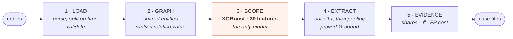
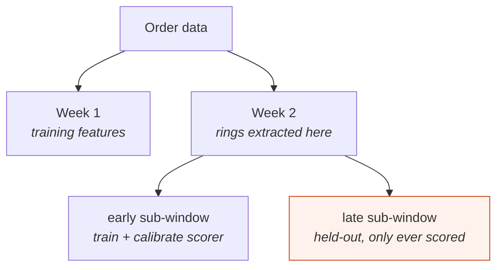
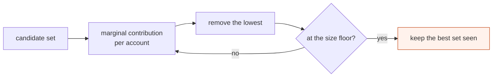

# How Orbweaver works

**[← README](../README.md)** · [Results](results.md) · [Design decisions](design-decisions.md) · [Data](data.md) · [Threat model](threat-model.md)

Orders in; ranked, evidenced rings out. Five stages — **one** is learned.



Headline: **0.7292 ring precision** against a 0.2242 base rate, at **0.371 real
customers flagged per fraudster caught**.

## The temporal split

Forward in time, account-disjoint. Held-out accounts appear in no training or
calibration step.



## Stage by stage

| # | Stage | What happens | The part that matters |
|---|---|---|---|
| 1 | **Load** | Parse both order files, cut on `order_time` | The two files use **different account id spaces**, which is why the whole evaluation lives inside week 2 ([data.md](data.md)) |
| 2 | **Graph** | Link accounts sharing a location, delivery record, promotion, coupon or sales stimulation | **Entity capping is part of the algorithm.** Uncapped, week 2 is 5.46 *trillion* pairs — one coupon type is shared by 97.5% of all users. Capping at 100 accounts/entity leaves 71.8M |
| 3 | **Score** | XGBoost over 39 engineered features, isotonic-calibrated | PPA ships **no** node features (every `node.csv` column is literally 1.0), so all 39 come from the order stream. Calibration isn't cosmetic — scores get summed against edge weights, so they must be probabilities |
| 4 | **Extract** | Prune below cut-off `τ`, then peel for densest subgraph | Without the prune, the densest subgraphs are ordinary communities and precision lands *below* base rate. The model narrows; the deterministic objective decides |
| 5 | **Evidence** | Shared entities + coverage + platform-wide rarity, day concentration, ₹ at stake, FP cost | Consults no model. Rarity is what makes coverage readable |

## Edge weight

```
w_r(e) = alpha_r / log(2 + |accounts(e)|)
```

Two factors, doing two different jobs:

- **Rarity** (the denominator), in the spirit of FRAUDAR's camouflage-resistant
  weighting: an attacker can cheaply add edges through *common* entities to
  dilute a group's density; rarity weighting makes those edges nearly worthless.
- **`alpha_r`** — what rarity alone cannot express: sharing a location is more
  incriminating than sharing a promotion. Fitted on training accounts only,
  from how much more often each relation joins two known fraudsters than chance.

The counter-intuitive result: **the relation that dominates the graph carries
the weakest signal.** Promotion edges are 70% of all edges at 1.76× lift;
location edges are 16% at 3.71×.

## The extraction objective

Maximise, over sets `S` with `k_min ≤ |S| ≤ k_max`:

```
g(S) = ( Σ w(u,v) for edges inside S  +  λ · Σ s(v) for members ) / |S|
```



**The guarantee.** Unconstrained, greedy peeling on this objective is a
**½-approximation** — the returned set has at least half the density of the
best possible one (Charikar 2000; Hooi et al., FRAUDAR KDD 2016 for the
edge-weight-plus-node-prior form). With a size floor it is NP-hard
(densest-at-least-k, Khuller & Saha 2009); with this project's ceiling it is
densest-at-most-k, also NP-hard — greedy keeps a constant-factor bound and
reaches ≥0.8 of optimum empirically (Xu et al., SIGMOD 2023). At scale a batch
variant removes everything below `(1+ε)×` the mean in one pass: a
2(1+ε)-approximation (Bahmani et al., VLDB 2012) that turns tens of millions
of sequential heap operations into ~100 vectorised passes.

Both bounds are on the **search**, not on whether density means fraud. That
second question is what the evaluation answers — and the answer is *not on its
own*, which is exactly why `τ` exists.

**The size ceiling is not a detail.** Density is a ratio, so a large region of
moderate density beats a small tight one. This graph's 50-core still holds
453,983 accounts; without a ceiling the extractor returned "rings" of 31,555
members. `k_max` makes the output reviewable by a person.

## What comes out

Two views on the same `ring_report.json`, so neither can disagree with
[results.md](results.md):

| Output | What it is |
|---|---|
| [`case-files.html`](case-files.html) | Standalone page, one card per ring, sorted by money at stake. No server, no build step — the artefact an analyst is handed |
| `make console` | The same data with filtering, drill-down, offers, account lookup and nightly replay. FastAPI + HTMX, still no bundle |

Each ring leads with its strongest evidence *and* how rare it is platform-wide,
because coverage without rarity is meaningless: 61% of one 38-account ring
share a sales stimulation only **35 accounts on the entire platform** have ever
used. That one line is the case.

## How it is measured

- **Account-disjoint** — held-out accounts appear in no training or calibration step.
- **Forward in time** — features and graph from `05-21…05-24`; held-out accounts scored on `05-25…05-28`.
- **Both labelling conventions** — 90.6% of accounts are unlabelled. Counting them as normal moves the base rate from 0.224 to 0.021, so every headline number is reported under both, and they are never compared to each other.
- **Every detection number carries its false-positive side** — a ring is a recommendation to act on a *group*, and being wrong about forty accounts costs forty customers at once.

---

**[← README](../README.md)** · Next: [why the ML boundary sits where it does →](design-decisions.md)
