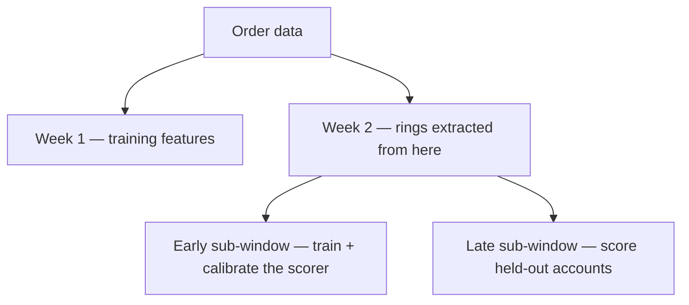
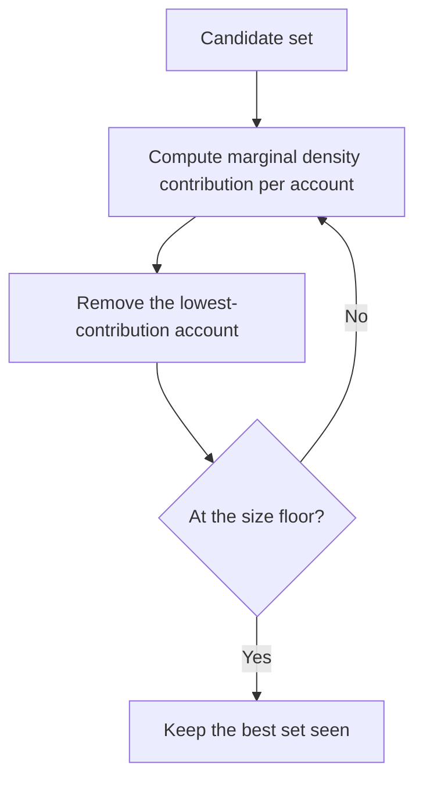

# How Orbweaver works

## In one minute

Order data goes in; ranked, evidenced rings of accounts come out, through
five stages, one of which is learned:

- **Load** — parse the two order files, cut on `order_time`, validate the
  temporal split.
- **Build graph** — link accounts that share an entity, weighted by how rare
  that entity is and how incriminating that relation type has proven to be.
- **Score accounts** — XGBoost over 39 engineered features; the only stage
  in the pipeline that is learned.
- **Prune, then peel** — drop accounts below a score cut-off, then extract
  dense subgraphs by densest-subgraph peeling, a deterministic search that
  carries a proved approximation bound.
- **Attach evidence** — for each ring, the entities its members share, when,
  how much money is at stake, and the cost of being wrong.

The headline: **ring precision 0.7292** against a base rate of 0.2242, at a
cost of **0.371 real customers flagged for every fraudster caught**.

**The temporal split.** Forward in time, account-disjoint: order data splits
into week 1, which produces training features, and week 2, which is where
the rings are extracted from. Week 2 itself splits into an early sub-window
that trains and calibrates the scorer, and a late sub-window whose accounts
are held out and only ever scored.



Five stages. Only one of them is learned, and the boundary is deliberate —
`docs/design-decisions.md` explains why it sits where it does.

```
  raw orders ──▶ 1. LOAD          parse, split on time, validate
                    │
                    ▼
                 2. GRAPH         accounts linked by shared entities,
                    │             weighted by rarity × relation value
                    ▼
                 3. SCORE         XGBoost over 39 features  ← the only model
                    │
                    ▼
                 4. EXTRACT       score cut-off, then densest-subgraph
                    │             peeling with a proved bound
                    ▼
                 5. EVIDENCE      what they share, when, ₹ at stake,
                                  and the cost of being wrong
```

## 1. Load

The two order files are parsed into columnar form and cut on `order_time`.
Two things about the raw data shape this stage, both in `docs/data.md`: the
timestamps are year-shifted to 1000 so `pandas.to_datetime` cannot represent
them, and the two files use **different account id spaces**, which is why the
whole evaluation lives inside week 2.

## 2. Build the graph

Two accounts are linked when they share an entity — a location, a delivery
record, a promotion, a coupon type, a sales stimulation.

**Entity capping is part of the algorithm, not an optimisation.** Uncapped,
week 2 is 5.46 trillion account-pairs, because one coupon type is shared by
97.5% of the entire user base. An entity that connects almost everyone is not
evidence of anything. Capping at 100 accounts per entity leaves 71.8 million
pairs.

**Edge weight** has two factors:

```
w_r(e) = alpha_r  /  log(2 + |accounts(e)|)
```

The second factor is entity rarity, in the spirit of FRAUDAR's
camouflage-resistant weighting: an attacker can cheaply add edges through
*common* entities to dilute a group's density, and rarity weighting makes
those edges nearly worthless.

The first factor, `alpha_r`, is what rarity alone cannot express: **sharing a
location is more incriminating than sharing a promotion.** Fitted on training
accounts only, from how much more often each relation joins two known
fraudsters than chance would predict. On this data the relation that dominates
the graph carries the weakest signal — promotion edges are 70% of all edges at
1.76× lift, while location edges are 16% at 3.71×.

## 3. Score accounts

XGBoost over 39 features, isotonic-calibrated. PPA ships no node features at
all — every column in `node.csv` is literally 1.0 — so all 39 are engineered
from the order stream: transaction shape, day-level timing, per-relation
degree, and the behaviour of an account's neighbours (never their labels).

Calibration is not cosmetic here. The extraction objective adds `λ · s(v)` to
a sum of edge weights, so the scores are summed against a physical quantity
and have to be probabilities rather than an arbitrary monotone margin.

## 4. Extract rings

Two steps, and the first matters more than I expected.

**Prune by score.** Accounts below a cut-off `τ` are removed before peeling.
Without this, the densest subgraphs on this graph are large ordinary
communities and ring precision lands *below* the base rate — dense is not the
same as fraudulent. The model narrows the field; the deterministic objective
then decides who is in the ring.

**Peel.** Maximise

```
g(S) = ( Σ_{(u,v) ∈ E[S]} w(u,v)  +  λ · Σ_{v ∈ S} s(v) ) / |S|
```

over sets `S` with `k_min ≤ |S| ≤ k_max`, by repeatedly removing the
lowest-contribution account and keeping the best set seen.



**The guarantee.** Unconstrained, greedy peeling on this objective is a
**½-approximation** — the set it returns has at least half the density of the
best possible one (Charikar 2000; Hooi et al., FRAUDAR, KDD 2016, for the
edge-weight-plus-node-prior form). With a size floor the problem is NP-hard
(densest-at-least-k; Khuller & Saha 2009), and with the ceiling this project
uses it is densest-at-most-k, also NP-hard; greedy keeps a constant-factor
bound and reaches ≥0.8 of optimum empirically (Xu et al., SIGMOD 2023). At
scale a batch variant removes every account below `(1+ε)×` the mean in one
pass, which is a 2(1+ε)-approximation (Bahmani et al., VLDB 2012) and turns
tens of millions of sequential heap operations into about a hundred vectorised
passes.

Both bounds are on the *search*, not on whether density means fraud. That
second question is what the evaluation answers, and the answer is: not on its
own, which is why `τ` exists.

**The size ceiling is not a detail.** Density is a ratio, so a large region of
moderate density beats a small tight one. This graph's 50-core still holds
453,983 accounts, and without a ceiling the extractor returned "rings" of
31,555 members. `k_max` makes the output something a person can review.

## 5. Attach evidence

Deterministic, and it consults no model. For each ring: the entities its
members share, with coverage and how rare each is platform-wide; day-level
timing concentration; rupees at stake; and the false-positive cost of the
members labelled normal.

Rarity is what makes coverage readable. "Nine of eleven members share a
delivery record that only nine accounts on the platform have ever used" is
evidence. "All eleven share a coupon type" is not, when 97.5% of the platform
shares it too.

## What comes out

Two views on the same `ring_report.json`, so neither can disagree with
`docs/results.md`:

- **`docs/case-files.html`** — a standalone page, one card per ring, sorted by
  money at stake. No server, no build step; this is the artefact an analyst
  could be handed.
- **`make console`** — the same data with filtering and drill-down, for a
  review queue working through it. FastAPI serving HTML fragments to HTMX, so
  there is still no build step and no JavaScript bundle.

Each ring leads with its strongest evidence and how rare that evidence is
platform-wide, because coverage without rarity is meaningless: 61% of one
38-account ring share a sales stimulation that only 35 accounts on the entire
platform have ever used, and that single line is the case.

## What is measured, and how

- **Account-disjoint.** Held-out accounts appear in no training or calibration
  step.
- **Forward in time.** Training features and graph come from `05-21…05-24`;
  held-out accounts are scored on `05-25…05-28`.
- **Both labelling conventions.** 90.6% of accounts are unlabelled. Counting
  them as normal moves the base rate from 0.224 to 0.021, so every headline
  number is reported under both and they are never compared to each other.
- **Every detection number carries its false-positive side**, because a ring is
  a recommendation to act on a group, and being wrong about a group of forty
  costs forty customers at once.

---

Back to [README](../README.md).
