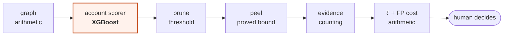

# Where machine learning is used — and where it deliberately is not

**[← README](../README.md)** · [Architecture](architecture.md) · [Results](results.md) · [Threat model](threat-model.md)

**Exactly one learned component sits in this pipeline.** Everything downstream
of it is deterministic arithmetic with a proved bound. That boundary is the
most deliberate design decision in the project.

## The split

| Stage | How it works | Learned? |
|---|---|---|
| Graph construction | Two accounts link when they share an entity; weight is `alpha_r / log(2 + users(e))` | No — arithmetic over one measured constant per relation |
| **Account scoring** | XGBoost over 39 features, isotonic-calibrated | **Yes — the only one** |
| Ring extraction | Greedy peeling on a density objective, proved approximation bound | No — deterministic |
| Evidence | Shared entities, coverage, rarity, day concentration, counted from orders | No — counting |
| ₹ at stake, false-positive cost | Arithmetic over stated assumptions | No |
| The decision to act | A human reads the case file | No |
| Label propagation *(reported beside the scorer)* | Fast Belief Propagation: one sparse linear system, convergence asserted in code | No — deterministic, provably convergent |

The one row worth pausing on is `alpha_r`. It is *fitted* — from how much more
often each relation joins two known fraudsters than chance predicts, on
training accounts only — so it isn't bare arithmetic. But it is **five numbers,
one per relation**, each of which I can print and argue with, refitted by
`make windows-weighted` rather than tuned by hand. That is a different kind of
object from a model with thousands of parameters.

> **A model scores accounts. It does not decide who is in a ring.** The ring is
> whatever the peeling objective returns, and that objective is forty lines of
> arithmetic that fit on one screen.

## Why the boundary sits exactly there

**1. "Why is this account in this ring?" has a checkable answer.** Removing it
lowers the group's density from *x* to *y*, and it shares these three entities
with these nine members. If ring membership came out of a learned model, the
honest answer would be "the model put it there" — and an analyst deciding
whether to freeze someone's account deserves better.

**2. The approximation guarantee means something.** Greedy peeling returns a set
within a factor of 2 of the densest possible one (Charikar 2000; Hooi et al.,
FRAUDAR KDD 2016); the batch variant used at scale is within 2(1+ε). No learned
model over this objective could offer a comparable statement. The guarantee is
about the **search**, which is exactly the part I want certainty about.

**3. It degrades predictably.** When the scorer is weak, ring quality falls back
toward pure structure rather than collapsing — `λ = 0` is a valid operating mode
using no model output at all. That matters here: the FRAUDAR baseline in the
PromoGuardian paper (F1 0.4715, structure only) beats their GraphSAGE baseline
(F1 0.2810, learned node features), which hints that on promotion-abuse graphs
the structure carries more signal than the node features do.

**4. λ makes the trade-off explicit rather than hidden.** The objective is
`(Σ edge weight + λ · Σ score) / |S|`. At `λ = 0` it is pure structure; as λ
grows the model's opinion dominates. I sweep λ and report the whole curve
instead of tuning to a single flattering value.

**5. A second provable method makes the same case again.** Fast Belief
Propagation — one sparse linear system, a stated convergence condition checked
in code, no training step — was added to test whether propagation beats a
feature model when labels are scarce. It does more than that: at full label
availability it beats **both** XGBoost and GraphSAGE on held-out AUPRC
(**0.4615** vs 0.3796 and 0.3819), and pruning on its beliefs alone reaches
**0.9886** ring precision against the learned scorer's 0.7292 at the same
review cost. It is not on the critical path either — but it is more evidence
that a method which can prove what it is doing is not a compromise.

## Why XGBoost and not a graph neural network

GADBench (NeurIPS 2023) found gradient boosting over graph-aggregated features
is a top performer on real anomaly-detection graphs, often beating GNNs
outright. It trains in about a minute on a laptop, its feature importances are
readable, and — most importantly — ring extraction downstream is
scorer-agnostic, so a better scorer drops in without touching the component
that produces the output.

The GNN is reported beside it whichever way the numbers fall. Two things about
running it honestly:

| Constraint | Why |
|---|---|
| **Mini-batches, not full-batch** | `SAGEConv` materialises one hidden vector per directed edge before aggregating: 71.4M directed edges × 64 dims = **18.3 GB for a single layer**, 36.6 GB for two, ~73 GB once autograd retains them. The machine has 16 GB. Neighbour sampling at fanout `[15, 10]` with 1024 seeds bounds a batch at ~170k edges (~43 MB) — and that figure doesn't grow with the graph. Measured peak RSS for the whole run: **5.42 GB**, ~42 seconds |
| **CPU, not Metal** | MPS scatter reductions accumulate non-deterministically: twelve identical batches diverge by 6e-8 at batch seven, and held-out AUPRC moved between 0.3825 and 0.3833 across runs. Far too small to change a conclusion, still enough to break the promise that a run reproduces. MPS is ~3× faster and one env var away (`ORBWEAVER_SAGE_DEVICE=mps`) for anyone who'd rather have the speed |

The neighbour sampler is hand-written against a CSR adjacency
(`orbweaver/scoring/sampler.py`, ~40 lines) because PyTorch Geometric's
`NeighborLoader` needs `pyg-lib` or `torch-sparse`, and neither publishes a
wheel for Python 3.13 on arm64 — the same wall that stopped the authors'
checkpoint.

## No language model anywhere in the detection or decision path

No LLM scores an account, chooses a ring member, sets a threshold, or decides
anything that affects an output.

Not distaste for the technology — this component has to answer three questions
an LLM answers badly: *what guarantee does this give?*, *why exactly is this
account here?*, and *what happens at the margin if I change this input
slightly?* Densest-subgraph peeling answers all three. It also runs in seconds
on 35 million edges, costs nothing per call, and returns the same answer every
time — none of which is true of a model behind an API.

There is one place an LLM would genuinely help: writing a finished case file up
in plain English. That is read-only, strictly downstream of every decision, and
entirely skippable. It is not implemented, and if it were, removing it would
change no number in this repository.

---

**[← README](../README.md)** · Next: [what this catches and what it misses →](threat-model.md)
