# Results

Generated by `make reproduce`. Every number here is read out of the run artefacts in `data/processed/`; none of it is typed in by hand.

Re-running the pipeline from an empty `data/processed/` reproduces this file exactly, with one deliberate class of exception: every wall-clock timing and peak-memory figure - the `/check` latencies (standard and anchored), the per-night seconds in the replay and in the anchored extraction, the nightly-snapshot seconds, and FaBP's solve time and resident memory - measures the machine that ran it, not the data, and will differ on yours. Everything else is derived from the data and should match byte for byte - I have checked that against clean clones rather than assuming it.

Treat every timing and memory figure as the order of magnitude and nothing finer. Three full runs on the same laptop put the nightly snapshot between 96 and 208 seconds, the spread being thermal rather than algorithmic, and the per-account lookup moved by a similar factor. The conclusions drawn from them - that a nightly pass is cheap, and that a single lookup is not a file read - hold comfortably across that whole range, which is the only reason they are quoted at all.

## The graph

- Week-2 late window, **35,701,750 edges** over the accounts active in it
- Entities shared by more than **100** accounts induce no edges
- Rings are constrained to **5–500 members**, top **25** extracted per setting
- Base rate among labelled accounts: **0.2242**

## Account scoring

Held-out accounts were absent from training and calibration, and are scored on a window strictly later than the one the model was trained on.

| accounts | n | base rate | AUPRC | lift | precision | recall | F1 | wrongly flagged per catch |
|---|---:|---:|---:|---:|---:|---:|---:|---:|
| `test_heldout__labelled_only` | 76,404 | 0.2242 | 0.3796 | 1.693× | 0.3072 | 0.7415 | 0.4344 | 2.256 |
| `train_pool__labelled_only` | 229,213 | 0.2242 | 0.3754 | 1.674× | 0.3066 | 0.7427 | 0.4340 | 2.261 |
| `test_heldout_plus_unlabelled__as_normal` | 3,038,748 | 0.0056 | 0.0168 | 2.982× | 0.0321 | 0.0920 | 0.0476 | 30.137 |
| `all_accounts__unlabelled_as_normal` | 3,267,961 | 0.0210 | 0.0578 | 2.758× | 0.0765 | 0.2062 | 0.1116 | 12.07 |

Reported at the best-F1 threshold. The two labelling conventions are not comparable to each other: counting unlabelled accounts as normal moves the base rate from 0.224 to 0.021.

Most important features: `active_days`, `orders_per_active_day`, `n_distinct_location`, `max_orders_in_day`, `n_distinct_stimulation`, `n_distinct_sku`.

### Gradient boosting against a graph neural network

Same split, same features, same window. The GNN can propagate along edges rather than only summarising a neighbourhood into fixed columns, so this is a fair test of whether that helps here.

| scorer | AUPRC | lift | precision | recall | F1 |
|---|---:|---:|---:|---:|---:|
| XGBoost, 39 features | 0.3796 | 1.693× | 0.3072 | 0.7415 | 0.4344 |
| GraphSAGE, 2 layers | 0.3819 | 1.703× | 0.3139 | 0.7079 | 0.4349 |

On held-out accounts, trained in under a minute on cpu with neighbour sampling at fanout [15, 10]. The two are within noise of each other — the GNN is very slightly ahead on AUPRC and very slightly behind on recall. That matches GADBench's finding that gradient boosting over graph-aggregated features is hard to beat on real anomaly graphs, and it means the choice of scorer is not where the value in this pipeline sits. I kept XGBoost as the default because it trains in a minute, its feature importances are readable, and neither result justifies the extra dependency.

## What each shared entity is worth

Entity rarity says how many people share a thing. It cannot say that sharing a location is more incriminating than sharing a promotion. Fitted on training accounts only.

| relation | meaning | labelled edges | fraud–fraud lift | weight |
|---|---|---:|---:|---:|
| `r1` | order location | 218,581 | 3.71× | 1.520 |
| `r3` | delivery record | 330 | 1.00× | 1.000 |
| `r6` | promotion | 199,590 | 1.76× | 0.723 |
| `r7` | coupon type | 5,174 | 1.67× | 0.686 |
| `r8` | sales stimulation | 275,333 | 2.61× | 1.071 |

## Rings

`τ` is the score cut-off applied *before* any peeling; `λ` weights model suspicion inside the peeling objective. At `λ = 0` no model output enters the objective — the model has narrowed the field, and density alone decides who is in the ring.

| τ | λ | rings | accounts | labelled | fraud | precision | vs base | real customers per catch | cost of being wrong |
|---:|---:|---:|---:|---:|---:|---:|---:|---:|---:|
| 0.0 | 0.0 | 25 | 423 | 230 | 16 | 0.0696 | 0.31× | 13.375 | ₹380,800 |
| 0.0 | 0.5 | 25 | 423 | 225 | 16 | 0.0711 | 0.317× | 13.062 | ₹361,600 |
| 0.0 | 1.0 | 25 | 423 | 228 | 16 | 0.0702 | 0.313× | 13.25 | ₹378,000 |
| 0.0 | 2.0 | 25 | 421 | 228 | 16 | 0.0702 | 0.313× | 13.25 | ₹378,800 |
| 0.0 | 5.0 | 25 | 467 | 227 | 16 | 0.0705 | 0.314× | 13.188 | ₹362,800 |
| 0.3 | 0.0 | 25 | 2,574 | 508 | 294 | 0.5787 | 2.581× | 0.728 | ₹189,200 |
| 0.3 | 0.5 | 25 | 3,035 | 590 | 338 | 0.5729 | 2.555× | 0.746 | ₹230,400 |
| 0.3 | 1.0 | 25 | 3,006 | 585 | 342 | 0.5846 | 2.607× | 0.711 | ₹222,000 |
| 0.3 | 2.0 | 25 | 3,074 | 599 | 351 | 0.586 | 2.613× | 0.707 | ₹226,000 |
| 0.3 | 5.0 | 25 | 1,948 | 420 | 253 | 0.6024 | 2.686× | 0.66 | ₹150,400 |
| 0.5 | 0.0 | 25 | 2,359 | 489 | 325 | 0.6646 | 2.964× | 0.505 | ₹140,400 |
| 0.5 | 0.5 | 25 | 1,964 | 389 | 259 | 0.6658 | 2.969× | 0.502 | ₹104,800 |
| 0.5 | 1.0 | 25 | 1,897 | 386 | 271 | 0.7021 | 3.131× | 0.424 | ₹89,200 |
| 0.5 | 2.0 | 25 | 1,674 | 345 | 242 | 0.7014 | 3.128× | 0.426 | ₹82,800 |
| 0.5 | 5.0 | 25 | 1,638 | 336 | 245 | 0.7292 | 3.252× | 0.371 | ₹74,400 |

Best cell: **τ = 0.5, λ = 5.0**, ring precision **0.7292** against a base rate of **0.2242**.

Ring recall is deliberately low. Rings surface a few hundred accounts for review, not the whole population — the question a queue asks is how many of the accounts it looks at are worth looking at.

The rupee figures rest on stated assumptions: PPA ships no monetary amounts at all. They rank operating points against each other and mean nothing in absolute terms.

## A case file

Ring of **7 accounts**, density 6.5859, 163 orders across 7 days, 42% of them on the busiest single day.
Labels: 4 fraud, 0 normal, 3 unlabelled.

| what they share | coverage | how many accounts share it platform-wide |
|---|---:|---:|
| order location | 57% of the ring | 4 |
| order location | 57% of the ring | 4 |
| sales stimulation | 43% of the ring | 3 |
| sales stimulation | 29% of the ring | 2 |
| sales stimulation | 29% of the ring | 2 |
| sales stimulation | 29% of the ring | 2 |

144 promotion orders x an assumed Rs.100 per promotion (PPA ships no monetary amounts; this is an assumption).

### How far down the queue is still worth reading

The same operating point, taken deeper. A review queue has a budget, so what matters is how quickly quality falls as you ask for more rings.

| rings | accounts surfaced | labelled | ring precision | vs base | real customers per catch | recall |
|---:|---:|---:|---:|---:|---:|---:|
| 25 | 1,638 | 336 | 0.7292 | 3.252× | 0.371 | 0.0036 |
| 200 | 8,167 | 1880 | 0.6654 | 2.967× | 0.503 | 0.0183 |

Eight times the depth costs about six points of precision (0.7292 to 0.6654) and buys roughly four times the coverage. Precision decays, it does not fall off a cliff, so the queue depth is a budget decision rather than a threshold to discover.

On held-out accounts alone the deep pass gives **0.6557** across 488 labelled members — within a point of the all-labelled figure, so there is no memorisation gap at depth either.

## A payment processor's graph

Everything above runs on food-delivery orders. This runs the pipeline unchanged on IEEE-CIS — 590,540 card transactions released by Vesta — where the relations are the ones a processor actually holds: the device, the e-mail domains on both sides, the billing address, the browser.

Three things before any number:

- This is card fraud, not promotion abuse. A stolen card used across merchants is a different mechanism from many accounts farming one offer; only the graph shape is shared.
- The account is a card fingerprint (card1|card2|card3|card5|addr1|addr2), not a person. One person with two cards is two accounts here.
- The identity file covers 144,233 of 590,540 transactions (24.4%), so device and browser edges exist for a quarter of the data and are missing, not zero, for the rest.

What this dataset has that PPA does not is real timestamps over six months, so the split carries **both** guarantees at once: days 1–84 train and 85–182 score, *and* the 10,749 held-out accounts are absent from training. On PPA the id spaces forced a within-week arrangement; here it is a straightforward forward split.

| relation | what it means | labelled edges | fraud–fraud lift | weight |
|---|---|---:|---:|---:|
| `address_distance` | the same billing address and distance band | 130,427 | 5.4226× | 2.0694 |
| `device` | the same device | 27,573 | 3.3057× | 1.2616 |
| `email_recipient` | the same recipient e-mail domain | 15,507 | 1.8782× | 0.7168 |
| `browser` | the same browser build | 22,929 | 1.5918× | 0.6075 |
| `email_payer` | the same payer e-mail domain | 23,687 | 0.9034× | 0.3448 |

The billing address with a distance band is the strongest relation here at 5.42×, and the device is second at 3.31×. The payer's e-mail domain is **below one** — sharing `gmail.com` with someone is evidence of nothing, and the weighting drops it to 0.34 without being told to.

| | |
|---|---|
| Held-out base rate | 0.028 |
| Node scoring | AUPRC 0.1567, 5.594× random |
| Rings | 25 over 382 accounts |
| Ring precision | **0.5079** — **18.138× the base rate** |
| Cost of that | 0.969 good cards flagged per fraudulent one caught |

**18.138× is the largest lift anywhere in this project**, and the reason is the base rate: 2.8% of held-out accounts are fraudulent here against 22.4% on PPA, so there is far more room above chance. The absolute precision, 0.51, is lower than PPA's 0.73. Both facts matter and quoting either alone would mislead.

### Where this one is weakest

The apartment-building analogue of the hostel test — 15+ cards billed to one address, 80%+ of labelled ones good — finds only **7** such clusters, and the method touches **4** of them. On PPA the equivalent figure is 2 of 2,446.

That is a bad number and it has an obvious cause: the billing address is simultaneously the **most informative relation on this dataset** (5.42×) and the thing that legitimately ties together every card in a building. The two cannot be separated by weighting, because the weighting is what discovered the address was informative in the first place. Seven clusters is far too small a sample to put a rate on, so I will not — but the direction is clear and it is the honest limitation of running this on payment data where addresses carry most of the signal.

## Does any of this work on a graph that is not PPA?

Every other number here comes from one dataset, from one platform, in one country. So I ran the pipeline unchanged on two fraud graphs that share the shape and nothing else — **Amazon** reviewers and **YelpChi** reviews (Dou et al., CIKM 2020; two of GADBench's ten datasets). Both are multi-relation graphs with node labels.

| dataset | nodes | edges | anomaly rate | node AUPRC | vs random |
|---|---:|---:|---:|---:|---:|
| amazon | 11,944 | 4,417,576 | 0.0687 | 0.7629 | 11.112× |
| yelpchi | 45,954 | 3,846,979 | 0.1453 | 0.8557 | 5.89× |

**The central finding replicates on both, independently.** Without the score cut-off, densest-subgraph extraction is worse than picking at random; with it, ring precision is far above the base rate.

| dataset | τ | ring precision | vs base | held-out members | held-out precision |
|---|---:|---:|---:|---:|---:|
| amazon | 0.0 | 0.0393 | 0.573× | 1634 | 0.0404 |
| amazon | 0.3 | 0.9797 | 14.271× | 169 | 0.9349 |
| amazon | 0.5 | 0.9822 | 14.307× | 169 | 0.9349 |
| yelpchi | 0.0 | 0.0 | 0.0× | 479 | 0.0 |
| yelpchi | 0.3 | 0.9918 | 6.827× | 63 | 0.9683 |
| yelpchi | 0.5 | 0.9956 | 6.853× | 111 | 0.982 |

On Amazon the unpruned extractor lands at 0.573× the base rate and on YelpChi at **exactly zero** — twenty-five rings, 1,914 accounts, not one of them fraudulent. Pruning first takes the same extractor to 14.3× and 6.9×. That is three datasets now, from three unrelated platforms, all saying that dense is not the same as fraudulent.

**These are easier problems than PPA, and the gap is instructive.** Node scoring reaches AUPRC 0.76 and 0.86 here against 0.38 on PPA, because both ship real node features — 25 and 32 dimensions of reviewer behaviour — while PPA ships none at all and every feature has to be engineered from the order stream. YelpChi's strongest relation carries a fraud lift of **49.8×**; PPA's best is 3.7×. Much of what makes PPA hard is the poverty of what it gives you, not the method.

Account-disjoint and stratified, but NOT forward in time: these files carry no timestamps. Rarity is approximated from endpoint degree because the entity ids are not recoverable from an adjacency.

## Feeding the web back into the strand

The argument this project makes is that a ring is invisible to a system scoring one transaction at a time. The fair follow-up is whether the ring view can give anything *back* to the per-account view — because if it can, a per-transaction system does not have to be replaced to benefit from any of this. It can consume a few extra columns.

Context comes from rings found on days [365018, 365021] and is joined to features from days [365022, 365025], so every context day strictly precedes every feature day. That is checked against the window manifests rather than assumed from the naming, because this is the easiest place in the whole pipeline to let the future inform the past. **1,293 accounts** were in a previous-window ring.

| how the score and the context are combined | held-out AUPRC | change |
|---|---:|---:|
| score alone | 0.3796 | — |
| score_times_context [in_previous_ring] | 0.3807 | +0.0011 |
| score_then_context [in_previous_ring] | 0.3799 | +0.0003 |
| score_times_context [previous_ring_confidence] | 0.3806 | +0.001 |
| score_then_context [previous_ring_confidence] | 0.38 | +0.0004 |
| score_times_context [neighbours_in_previous_rings] | 0.3803 | +0.0007 |
| score_then_context [neighbours_in_previous_rings] | 0.3801 | +0.0005 |
| score_times_context [rare_entity_overlap_with_previous_rings] | 0.3803 | +0.0007 |
| score_then_context [rare_entity_overlap_with_previous_rings] | 0.38 | +0.0004 |
| fitted blend | 0.3803 | +0.0007 |

**This did not work, and the ceiling was set before the model ever ran.** The best combination moves held-out AUPRC by +0.0011, which is a rounding error. The reason is coverage: the most widespread context feature touches **0.76% of held-out accounts**, and only 0.15% of them were in a previous-window ring at all. A feature that is zero for more than ninety-nine accounts in a hundred cannot move an aggregate metric, whatever it says about the hundredth.

This is the same fact the nightly replay found, seen from another angle. Rings do not persist from one night to the next, and they do not transfer from one window to the next either. They are window-specific objects: the accounts recur, the groupings do not. So ring membership is a poor thing to carry forward as a feature, and I would rather say that than report a fitted blend that squeezes out a third decimal place.

How much of the held-out set each context feature actually touches, which is the ceiling on how much any of them could matter:

| context feature | held-out accounts with a non-zero value | share |
|---|---:|---:|
| `in_previous_ring` | 116 | 0.15% |
| `previous_ring_confidence` | 116 | 0.15% |
| `neighbours_in_previous_rings` | 581 | 0.76% |
| `rare_entity_overlap_with_previous_rings` | 184 | 0.24% |

### Asking about one account

A per-transaction system would not run a batch job; it has one account in front of it and needs an answer inside a request. `GET /check/{account}` returns the score, ring membership and its evidence, how many neighbours are in rings, and the rupee assumption that travels with every figure. Indexes are built once at start-up, so a lookup is array indexing rather than a file read.

Measured over 1,000 random accounts: **p50 0.01 ms, p95 0.059 ms**, worst 0.308 ms. `scripts/check_demo.sh` asks about an account inside a ring and one outside it.

## Ranking rings by a learned confidence

The queue is ordered by density, which is the crudest thing it could be. Density says how tightly a group is connected; it does not say how likely the group is to be fraudulent, and the whole reason the score cut-off exists is that those are different questions. So this learns a ring-level model and compares it against density and against the obvious baseline anyone would reach for first, the mean score of a ring's members.

Candidates come from the early window: **693 rings** across a spread of operating points, of which **479** have enough labelled members to carry a label and **434** are majority-fraud. The account scores used to build them are five-fold out-of-fold, so no ring is assembled from scores that had already seen its own members' labels.

| rings reviewed | density | mean member score | learned confidence |
|---:|---:|---:|---:|
| 25 | 0.6859 | 0.7667 | 0.548 |
| 100 | 0.5976 | 0.6951 | 0.5866 |
| 200 | 0.5814 | 0.6739 | 0.5989 |

On held-out members only:

| rings reviewed | density | mean member score | learned confidence |
|---:|---:|---:|---:|
| 25 | 0.7042 | 0.8333 | 0.4328 |
| 100 | 0.5735 | 0.703 | 0.5406 |
| 200 | 0.5684 | 0.6719 | 0.5678 |

**The learned model lost, and the baseline won.** At 25 rings, mean member score reaches 0.7667 against 0.548 for the learned confidence and 0.6859 for density. Ordering the queue by the mean score of a ring's members beats both the thing it does today and the thing I built to replace it.

The reason is visible in the training data. Of 479 candidate rings with enough labelled members, **434 are majority-fraud — 90.6%**. Candidates are generated at score cut-offs of 0.3 and 0.5, and that cut-off is precisely the thing that makes rings fraud-enriched in the first place. By the time a ring is a candidate, it is almost certainly fraudulent, so there is nearly nothing left for a ring-level model to separate. The calibration shows it collapsing: 441 of the rings are predicted at 1.0, and the one bucket it does push down it gets wrong in the other direction — predicted 0.277 against a realised 0.658.

I am leaving the comparison in rather than deleting the experiment, because the useful result is the baseline. Reordering the queue by mean member score is a free improvement over density and I would not have found it if I had only compared my model against the status quo.

The population this must not promote is the legitimate co-located clusters. 7 of the candidate rings sit mostly inside one, and their median confidence is **1.0** against 1.0 across all rings — identical, which is not reassurance but another symptom of a model that gives almost everything the same answer.

Every ring carries the three features that moved its confidence most, so a reviewer opening a case sees why it is near the top rather than only that it is. For the highest-confidence ring those are: `internal_weight_per_member`, `score_mass_per_member`, `busiest_day_share`.

## Watching the window day by day

Everything above is forensic: it takes a window that has already happened and finds the rings in it. That is a fair way to measure the method and it is not how it would be used. So this replays the scoring window one night at a time — each night rebuilds the graph and features from the days up to that night only, applies the model **already fitted on the earlier window** (nothing is refitted, because a system running on the 25th cannot use a model trained on the 28th), and peels at the standard operating point.

| nights of data | edges | rings | accounts surfaced | share worth reviewing | real customers per catch | seconds |
|---:|---:|---:|---:|---:|---:|---:|
| 1 | 8,094,116 | 25 | 1,271 | 0.2045 | 3.891 | 51 |
| 2 | 16,895,955 | 25 | 1,849 | 0.4869 | 1.054 | 79 |
| 3 | 25,921,810 | 25 | 1,368 | 0.6098 | 0.64 | 112 |
| 4 | 35,701,750 | 25 | 1,638 | 0.7292 | 0.371 | 156 |

**One night of data is not enough.** With a single night the queue is at 0.2045 against a base rate of 0.2242 — no better than picking accounts at random — and it costs 3.891 real customers for every fraudster caught. By the fourth night it is 0.7292 at 0.371, which is a tenfold improvement in the cost of being wrong. The method needs a few days of accumulated structure before it has anything to say, and that is a real operational constraint rather than a tuning problem.

A nightly snapshot takes about 96 seconds end to end — build, score and peel — on a laptop, so running this every night is not the expensive part of operating it.

### The thing I could not measure

I wanted to report days-to-detection per ring: the night each of the final rings first became visible. That turns out not to be answerable, and the reason is worth more than the number would have been.

**Ring identity does not survive a night.** Matching each final ring against every ring from an earlier night, the best overlap reached is a median of 0.124 and a maximum of 0.359, against the 0.5 I required to call it the same group. Not one of the 25 final rings had a recognisable predecessor. Peeling is a global optimisation, so a night of new edges shifts densities everywhere and the top rings are recomposed rather than extended — the accounts do not vanish, the grouping does.

So the honest version of the question drops group identity and asks how much of each final ring was already being surfaced *somewhere* on an earlier night. By that measure **28% of the final rings had half their members already inside some surfaced ring before the last night**, and at that point 37% of their promotion spend was still ahead of them. That is the number a team could act on, and it is much weaker than the one I set out to report.

## A ring you can find again tomorrow

The nightly replay found that ring identity does not survive a night. Peeling is a global optimisation, so one more day of edges shifts densities everywhere and the top rings are recomposed rather than extended: the best overlap between a final ring and anything from an earlier night was a median Jaccard of 0.124, and not one ring had a predecessor at the 0.5 the replay required. An operations team cannot open a case on Monday and find it on Tuesday, and days-to-detection could not be measured.

So this extracts rings **around anchors** instead - the anchored densest subgraph of Dai, Qiao, Chang and Qin (SIGMOD 2022), in its strict form. For an anchor account the candidate set is the ball `{a} ∪ N(a) ∪ N²(a)` inside the reference set R = {accounts with score > 0.5}, capped at 3,000 nodes by descending edge weight, and greedy peeling runs on that ball with the anchor pinned so it is never removed. Because the ball is intersected with R first, the outsider penalty in their objective vanishes and it reduces to the weighted density used everywhere else here; that is the special case in which outsiders are forbidden rather than penalised. Anchors each night are the top 500 accounts by score inside R plus every member of last night's rings, so a case has something to be found again from. Rings from different anchors that overlap at Jaccard 0.5 are one ring, kept under its highest-scoring anchor.

Identity from one night to the next follows Greene, Doyle and Cunningham (ASONAM 2010): tonight's rings are matched to last night's by Jaccard above θ, each is assigned one of born / continued / merged / split / died, and a case id is carried along the timeline from the first ring in it. They used θ = 0.3; both 0.3 and 0.5 are reported. A ring unobserved for 1 night is dead.

| night | reference set | anchors | rings found | after de-duplication | median ring size | precision, top 25 | real customers per catch | extract (s) |
|---:|---:|---:|---:|---:|---:|---:|---:|---:|
| 1 | 52,699 | 500 | 498 | 146 | 34 | 0.3035 | 2.295 | 1.2 |
| 2 | 62,982 | 1,794 | 1,608 | 246 | 14 | 0.5506 | 0.816 | 3.4 |
| 3 | 65,858 | 1,827 | 1,454 | 288 | 6 | 0.4839 | 1.067 | 2.9 |
| 4 | 78,089 | 1,974 | 1,534 | 334 | 6 | 0.7167 | 0.395 | 2.9 |

**Does it survive the night?** The anchored tracker only ever matches a ring against *last night*, because a front is one night old. Comparing that against global peeling's best overlap with **any** earlier night would be an easier test for global than for anchored, so the like-for-like column restricts global to the same single night; the looser number is kept beside it so the comparison cannot be accused of being rigged.

| final rings with a predecessor | global, previous night only | global, any earlier night | anchored |
|---|---:|---:|---:|
| θ = 0.3 (Greene et al.) | 0% | 4% | **44%** |
| θ = 0.5 | 0% | 0% | **27%** |
| median overlap with the predecessor | 0.09 | 0.124 | **0.6** |

Given the same one night that anchoring gets, **no** global ring has a predecessor at either threshold, and its median overlap with last night is 0.09. Anchored rings match at a median Jaccard of 0.6 - not the same set of accounts, but recognisably the same group, which is what a case id has to mean.

On the final night at θ = 0.3, of 25 ranked rings the tracker saw 134 continued, 3 merged, 9 split and 188 born, with 149 of the previous night's rings dying and 2 absorbed.

**Days to detection, which is now measurable.** Each final ring's timeline has a first night, and that is when a case with this id first existed.

| first seen on | final rings |
|---|---:|
| night 1 of 4 | 0 |
| night 2 of 4 | 6 |
| night 3 of 4 | 10 |
| night 4 of 4 | 9 |

Median 3 of 4 nights, range 2-4; **64% of the final rings had a case open before the last night**, against 0% under global peeling. When a case first opened, **55.2% of its promotion spend was still ahead of it** (₹42,200 of ₹76,500, on the stated ₹-per-promotion assumption) - the part an intervention could have reached. A ring that was split off another timeline counts as born on the night of the split, which is the strict reading; its members were visible inside the parent before that.

**Precision on the final night, against the global extractor.** Same night, same operating point, top 25 by density in both cases.

| | ring precision | real customers per catch | fraud accounts found |
|---|---:|---:|---:|
| global peeling | **0.7292** | 0.371 | — |
| anchored | **0.7167** | 0.395 | 86 |
| anchored, ranked by mean member score | 0.6364 | 0.571 | 35 |

Anchored is **+0.0125 worse** on precision. That is the expected direction and the reason is structural: each anchored ring is a local optimum on a ball of at most 3,000 nodes, where global peeling optimises over the whole pruned graph; and the anchors are chosen by score, so anchoring inherits every bias the scorer has. What is bought with that precision is the case id - a ring that exists tomorrow - and the section above is the measurement of whether that trade is worth making.

**How many anchors.** N's effect on the final night, top-N anchors only:

| anchors | rings found | after de-duplication | precision, top 25 | real customers per catch | seconds |
|---:|---:|---:|---:|---:|---:|
| 200 | 80 | 61 | 0.6981 | 0.432 | 0.1 |
| 500 | 206 | 133 | 0.8875 | 0.127 | 0.4 |
| 1,000 | 412 | 244 | 0.7215 | 0.386 | 0.7 |

**On demand.** `GET /check/{account}` now computes the ring around the account live from its ball, when the account is inside R, and returns it with its case id and first-seen night. Over 1,000 anchors: **p50 0.063 ms, p95 1.21 ms**, worst 3.283 ms. A full night's extraction over every anchor takes 2.9 s on top of building the night's graph.

## What to do with the queue, given a budget

Every result above says which groups look worst. None of them says what to do on a night when one analyst has an hour, and none of them prices the cost of holding a promotion for a group that turns out to be a hostel. Detection and investigation are different constraints and the second is usually the binding one, so this turns the queue into a decision.

There are three things a team can do with a ring. **Review** it, which costs analyst minutes and - assuming they then act correctly - stops the fraud in it without touching anyone legitimate. **Auto-hold** the members' promotions, which costs no analyst time, stops the fraud, and harms every legitimate member by some fraction of their value. Or **ignore** it. The review set is chosen by exact 0/1 knapsack against the night's budget, and any ring not reviewed is auto-held when holding beats ignoring. Because reviewing is never worse than holding, what an item carries into the knapsack is the *gain from reviewing over the best thing you could do without an analyst* - otherwise the optimiser would spend minutes on rings that auto-holding already handles.

The framing is example-dependent cost-sensitive learning: a false positive costs an administrative amount, a false negative costs the amount at stake, and the number that matters is savings against doing nothing (Bahnsen, Aouada and Ottersten, ESWA 2016; Elkan, IJCAI 2001).

**Every rupee below is an assumption.** PPA ships no monetary amounts at all, so these are stated constants:

| assumption | value |
|---|---:|
| a promotion is worth | ₹100 |
| a customer is worth, per week-1 order | ₹400 |
| an analyst's minute costs | ₹10 |
| reviewing a ring takes | 3.0 + 0.25 per member minutes |
| a wrongly held customer loses | 10% of their value |

They rank policies against each other and mean nothing in absolute terms. A ring's probability of being fraudulent is the mean of its members' calibrated scores. Member scores are calibrated; their mean is not a calibrated ring-level probability, so this is a ranking signal used as a probability.

**The final night**, queue of 200 rings ordered by mean member score, of which ₹68,100 sits on accounts labelled fraud. A perfect reviewer is assumed here; the 90% variant is below.

| budget | policy | reviewed | auto-held | minutes | fraud ₹ stopped | legitimate ₹ harmed | savings |
|---:|---|---:|---:|---:|---:|---:|---:|
| 30 | capacity-aware | 4 | 176 | 30 | ₹67,900 | ₹15,840 | 0.7601 |
| 30 | density order until the budget is spent | 2 | 0 | 29 | ₹0 | ₹0 | -0.0043 |
| 30 | auto-hold everything | 0 | 200 | 0 | ₹68,100 | ₹17,280 | 0.7463 |
| 30 | do nothing | 0 | 0 | 0 | ₹0 | ₹0 | 0.0 |
| 60 | capacity-aware | 7 | 173 | 60 | ₹67,900 | ₹16,040 | 0.7527 |
| 60 | density order until the budget is spent | 5 | 0 | 60 | ₹200 | ₹0 | -0.0059 |
| 60 | auto-hold everything | 0 | 200 | 0 | ₹68,100 | ₹17,280 | 0.7463 |
| 60 | do nothing | 0 | 0 | 0 | ₹0 | ₹0 | 0.0 |
| 120 | capacity-aware | 16 | 165 | 120 | ₹67,900 | ₹13,320 | 0.7838 |
| 120 | density order until the budget is spent | 13 | 0 | 117 | ₹9,800 | ₹0 | 0.1267 |
| 120 | auto-hold everything | 0 | 200 | 0 | ₹68,100 | ₹17,280 | 0.7463 |
| 120 | do nothing | 0 | 0 | 0 | ₹0 | ₹0 | 0.0 |
| 240 | capacity-aware | 36 | 146 | 240 | ₹67,900 | ₹9,680 | 0.8197 |
| 240 | density order until the budget is spent | 33 | 0 | 238 | ₹18,200 | ₹0 | 0.2323 |
| 240 | auto-hold everything | 0 | 200 | 0 | ₹68,100 | ₹17,280 | 0.7463 |
| 240 | do nothing | 0 | 0 | 0 | ₹0 | ₹0 | 0.0 |

**The analyst budget barely changes how much fraud is stopped.** From 30 minutes to 240, fraud value stopped moves from ₹67,900 to ₹67,900 - under 0.0% - while legitimate value harmed falls from ₹15,840 to ₹9,680, a drop of 39%. Auto-holding already stops almost everything; what analyst time buys is not catching more, it is releasing the groups that should never have been held. On these assumptions the reviewer is a false-positive control rather than a detector, which is not what I expected to find and is the most useful thing in this section.

**Working the queue in density order loses money** at 30, 60 minutes: it spends the analyst's time and stops ₹0 at 30 minutes. Density ranks how tightly a group is tied together, which is not the same as how much is at stake in it, so a queue sorted that way puts small dense rings ahead of large expensive ones. That is the same lesson as the ring-ranking result above, arriving from the cost side.

At 30 minutes the capacity-aware policy stops ₹67,900 against ₹0 for working down the queue in density order, and at 240 minutes ₹67,900 against ₹18,200. Auto-holding everything stops the most fraud of any policy and needs no analyst at all - it also harms ₹17,280 of legitimate value doing it, which is the whole reason the review budget exists.

**A reviewer who is right nine times in ten**, at 60 minutes: ₹67,660 stopped against ₹67,900 for a perfect one, and ₹16,164 of legitimate value harmed against nothing. The perfect-reviewer number is an upper bound and is labelled as one everywhere it appears.

**How much churn matters.** Churn is what a wrongly held customer costs. It should change which rings are worth auto-holding and never which are worth an analyst's time, and that is what it does:

| churn | rings reviewed at 60 min | rings auto-held | fraud ₹ stopped | legitimate ₹ harmed |
|---:|---:|---:|---:|---:|
| 5% | 8 | 178 | ₹68,100 | ₹7,640 |
| 10% | 7 | 173 | ₹67,900 | ₹16,040 |
| 25% | 7 | 168 | ₹67,900 | ₹38,000 |

**One analyst, two hours a night**, working the nightly queues as they arrived - the case ids come from the anchored extraction, so a ring reviewed on one night is the same case if it returns on the next:

| night | queue | cases reviewed | auto-held | minutes | fraud ₹ stopped | running total |
|---:|---:|---:|---:|---:|---:|---:|
| 1 | 146 | 7 | 56 | 120 | ₹28,000 | ₹28,000 |
| 2 | 200 | 11 | 150 | 120 | ₹63,600 | ₹91,600 |
| 3 | 200 | 18 | 164 | 120 | ₹53,500 | ₹145,100 |
| 4 | 200 | 16 | 165 | 120 | ₹67,900 | ₹213,000 |

By the last night that is ₹213,000 of promotion value stopped for ₹71,840 of legitimate value harmed, on the assumptions above.

Each case card now carries its recommended action and the two numbers behind it: what reviewing it is expected to be worth, and what auto-holding it is expected to be worth. A reviewer who disagrees can see exactly which of the two the recommendation turned on.

## A demo anyone can click

Everything above needs the raw dataset: four gigabytes from OSF, an hour of processing and about thirty gigabytes of free disk. That is a fair price for reproducing the numbers and an absurd one for looking at the thing. So the repository carries a small bundle of already-computed results, and the console serves them whenever `data/processed` is empty - no dataset, no pipeline, no build step.

| file | size |
|---|---:|
| `offers.json` | 1.16 MB |
| `accounts.parquet` | 0.38 MB |
| `policy.json` | 0.06 MB |
| `rings.json` | 0.06 MB |
| `anchored.json` | 0.02 MB |
| `replay.json` | 0.02 MB |
| `hostel_test.json` | 0.00 MB |
| **total** | **1.69 MB** of a 42 MB limit |

It carries 50,000 accounts of the 3,267,961 in the run - every member of every ring the console shows (542 accounts) plus a random sample, so the page answers for ordinary accounts and not only for suspicious ones.

**What is deliberately not in it: the graph.** Thirty-five million edges do not belong in something meant to be cloned, so in demo mode `/check` serves stored neighbour counts instead of computing a ring around an account live. The full console does that in about a millisecond; the demo says which one you are looking at rather than letting the distinction pass. Every page carries that notice.

`requirements-demo.txt` is six packages and none of the pipeline: no pandas, no XGBoost, no matplotlib. It needs pydantic and PyYAML beside the obvious four because the console loads the project config to find the bundle and read the rupee assumptions.

## Telling a crowd from a ring by when it formed

On the processor graph the billing address is at once the strongest relation and the thing that legitimately ties together every card in a building, and weighting cannot separate them because weighting is what found the address informative in the first place. Rarity has the same blind spot on PPA: a hostel's address and a ring's address are equally rare. The published discriminator is time rather than rarity - CopyCatch (Beutel et al., WWW 2013) argues that coordination clusters in a narrow window while natural activity spreads across it - so this measures, per entity, how concentrated in time its members' first arrivals are, corrected for the entity's size against a simulated null, and turns the excess into a second, separate edge weight.

**The null is the part that has to be right.** A two-account entity can only have arrived on at most two distinct days, so raw concentration is guaranteed by size alone. `burst_z(e)` is the entity's concentration against 10,000 simulated draws of the same size, arriving independently in proportion to the platform's own daily activity - the excess over what size alone would produce, not the raw number. A hand-built entity whose members all arrive the same day gets a z of 12; two-account entities average to z ≈ -0.03, not a systematic high score just for being small.

**Fitted, never chosen**, on training accounts only, exactly like the relation weights themselves: 229,213 accounts visible, 76,404 held out and excluded.

| relation | entities | Q1 lift | Q2 lift | Q3 lift | Q4 lift |
|---|---:|---:|---:|---:|---:|
| r1 | 501,425 | 4.3894 | 3.7915 | 3.9358 | 3.1359 |
| r3 | 5,219 | 1.0 | 1.0 | 1.0 | 1.0 |
| r6 | 100,685 | 1.0 | 2.9322 | 2.5201 | 1.7709 |
| r7 | 8,392 | 1.5433 | 1.0 | 1.5107 | 1.7007 |
| r8 | 347,785 | 1.0 | 1.0 | 2.3492 | 2.58 |

**The direction splits by relation, and not along the split I expected.** Ranked by how many entities each relation has - `r1` 501,425, `r8` 347,785, `r6` 100,685, `r7` 8,392, `r3` 5,219 - the two most populous, `r1` and `r8`, disagree with each other: `r1`'s least bursty quartile carries the highest fraud lift (4.39, falling to 3.14 at the most bursty quartile) while `r8`'s rises the other way (1.0 to 2.58). `r6` agrees with `r1`'s direction (2.93 falling to 1.77); `r7`, on far less data, ends up agreeing with `r8`'s. So the result is not "CopyCatch's direction fails here" - it is relation-specific, and I do not have a story that explains the split cleanly. The candidate explanation for `r1` and `r6` is that their most extreme bursts are plausibly genuine marketing events - a promotion launch, a lunch-hour rush at one popular pickup point - where many ordinary customers order inside the same narrow window for a reason that has nothing to do with coordination; `r8`, sales stimulation, may simply not carry that kind of legitimate spike the same way. I am reporting the split rather than picking the half of it that makes a tidier story.

**Ring metrics at the headline operating point, both graphs:**

| | standard graph | lockstep graph |
|---|---:|---:|
| ring precision | 0.7292 | 0.7143 |
| real customers per catch | 0.371 | 0.4 |
| fraud accounts found | 245 | 165 |

Lockstep weighting moves ring precision by -0.0149. This row sits beside the headline in the README; it never replaces it.

**The crowd test, generalised to all five relations, both ways:**

| relation | clusters found | touched, standard | touched, lockstep |
|---|---:|---:|---:|
| r1 | 2,446 | 2 | 1 |
| r3 | 0 | — | — |
| r6 | 13,546 | 122 | 101 |
| r7 | 727 | 3 | 3 |
| r8 | 1,656 | 6 | 5 |

**Collateral moves the other way from precision.** Of the 4 relations with any legitimate crowds to touch, 3 touch fewer under the lockstep graph, 1 unchanged, and none touch more. Ring precision cost 0.0149 at the headline operating point; the trade is a small amount of precision for a measurable fall, never a rise, in the false-positive population this project cares most about protecting.

**IEEE-CIS is the strong arm** - `TransactionDT` is seconds over six months, so hour, six-hour and day windows are all meaningful, unlike PPA's day-only resolution. Same design, reapplied at each. The billing-address weakness this arm sets out to fix: 4 of 7 apartment clusters touched under the standard graph.

| resolution | ring precision | address clusters touched |
|---|---:|---:|
| standard (no time weighting) | 0.5079 | 4 of 7 |
| 1 hour | 0.4962 | 4 of 7 |
| 6 hour | 0.495 | 4 of 7 |
| 1 day | 0.5079 | 4 of 7 |

No resolution touches fewer apartment clusters than the standard graph. Time weighting does not fix the weakness this arm was built to test; the billing address stays informative and collateral for the same reason stated in the processor-graph section - the two cannot be separated by an edge weight, because the weight is what discovered the address was informative in the first place.

## Which offers are being farmed

Every other view in this project is account-shaped. The person who owns the promotion budget thinks in campaigns - which offer is leaking, how much, and since when - and Razorpay issues promotions itself through its rewards marketplace, so that is the view its own business would open first. There is a structural reason too: ring recall is 0.0036 by construction, because twenty-five rings surface a few hundred accounts. One farmed offer surfaces every account that redeemed it, which scales where the ring view cannot.

**The leakage score never sees a label.** It is the share of an offer's redeemers a ring already flagged, or the account scorer's mean opinion of them - both computable before anyone checks who is actually fraudulent. The labelled fraud share is the evaluation target, computed separately and never fed back in.

**117,056 offers** survived across `r6`, `r7` and `r8` in the scoring window, out of 5,337,252 excluded as too small to be a campaign (fewer than 5 redeemers - `r8` alone has millions of once-used codes) and 1 excluded as a platform default rather than something anyone farmed - one `r7` value alone covers 262,722 accounts, 10% of everyone active in the window, the coupon-type analogue of the near-universal default `docs/architecture.md` already documents for the graph.

**precision@k, ranked by leakage, against the labelled base rate and against k random offers:**

| top-k | leakage-ranked precision | vs base rate | k random offers (mean) |
|---:|---:|---:|---:|
| 10 | n/a - no labelled redeemer in the top-k | — | 0.1967 |
| 25 | 0.7887 | 0.5645 | 0.2068 |
| 50 | 0.5346 | 0.3104 | 0.2162 |

**The top 10 by raw ring-share is undefined, and that is itself informative.** At this depth the ranking is dominated by ties among the smallest offers - five or six redeemers, nearly all already in a ring - and on a dataset where 90.6% of accounts are unlabelled, several of those ties land entirely among accounts nobody has reviewed. That is not a broken ranking; it is what "most of the platform is unlabelled" looks like at k=10, stated as the caveat it is rather than smoothed over.

**Coverage against the recall ceiling, two ways** - the honest comparison of two review surfaces, since ring recall is 0.0036 by construction. Ranking by leakage is precise but the offers it puts first are small, which caps how much of total fraud they can ever touch; ranking by raw size answers a different question - how far past the recall ceiling can this surface reach at all, at the cost of reviewing far more accounts.

| top-k | leakage-ranked coverage | accounts | size-ranked coverage | accounts |
|---:|---:|---:|---:|---:|
| 10 | 0.01% | 65 | 2.82% | 155,893 |
| 25 | 0.01% | 147 | 5.26% | 240,800 |
| 50 | 0.04% | 292 | 7.08% | 325,494 |

Fifty offers ranked by size cover 7.08% of all labelled fraud against the ring's 0.36% - 19.7x the recall ceiling - at the cost of 325,494 accounts reviewed instead of a few hundred. Neither ranking is the answer; which one to use is a policy choice about how much review capacity exists, not a technical one.

**Early warning inside the replay.** Of 4,074 offers confirmed bad by the window's end (majority of labelled redeemers fraudulent), 1,240 crossed 10% above the platform's own same-night high-score rate before the window closed, at a median of night 2.

The other 2,834 never crossed the margin inside the window - a real limit stated rather than hidden: an offer can be confirmed bad only once enough of its redeemers accumulate to say so, and for some that happens no earlier than the final night.

## How many confirmed cases before this works

The first thing a risk lead asks about a system like this is not how good it is but whether it works before any confirmed ring labels exist. This project had answered the two extremes without meaning to - zero labels lands at 0.0696, below the 0.2242 base rate, and all of them reach 0.7292 - with nothing in between. The space between is the entire deployment plan for a team starting from nothing.

The scorer and its calibration are refitted from scratch at each point on a stratified, nested fraction of the training pool - the same 3 seeds' subsets at 5% are contained in the subsets at 10%, and so on - using the pipeline's own `fit_scorer` unchanged. The 100% point reuses today's training split exactly rather than resampling "everything", which is what makes it a guard: it reproduces 0.3796 AUPRC and 0.7292 ring precision, matching the committed headline.

| labelled accounts | fraction | held-out AUPRC (range) | ring precision (range) | real customers per catch | fraud found |
|---:|---:|---:|---:|---:|---:|
| 1,146 | 0.5% | 0.2881 (0.2835-0.2909) | 0.6359 (0.4124-0.7941) | 0.7033 | 151.3 |
| 2,292 | 1.0% | 0.2919 (0.2785-0.3078) | 0.4547 (0.3478-0.5514) | 1.2797 | 133.7 |
| 4,584 | 2.0% | 0.3153 (0.302-0.323) | 0.631 (0.5238-0.7383) | 0.6163 | 139.0 |
| 11,461 | 5.0% | 0.3376 (0.3336-0.3418) | 0.6907 (0.5778-0.7652) | 0.47 | 183.3 |
| 22,921 | 10.0% | 0.3493 (0.3449-0.354) | 0.6664 (0.6582-0.6742) | 0.5007 | 279.7 |
| 45,843 | 20.0% | 0.358 (0.3537-0.3611) | 0.6753 (0.6558-0.6886) | 0.4817 | 238.0 |
| 114,606 | 50.0% | 0.368 (0.3663-0.3698) | 0.6789 (0.6337-0.7351) | 0.4783 | 212.3 |
| 229,213 | 100.0% | 0.3796 (0.3796-0.3796) | 0.7292 (0.7292-0.7292) | 0.371 | 245.0 |

**The knee: 1,146 confirmed accounts** (0.5% of today's training pool) is the smallest label count at which prune-then-peel first beats the base rate, reaching 0.6359 ring precision. Reported as a count rather than only a percentage, because a count is what a team starting a labelling effort can actually plan against - a percentage of an as-yet-unknown future pool is not.

**No plateau was observed.** AUPRC keeps gaining at or above the stated 0.01 threshold for most of the sweep, including its last doubling - 114,606 to 229,213 accounts still buys +0.0116 AUPRC. More confirmed labels would plausibly still help past what this sweep covers.

**Ring precision at the smallest fraction tested - 1,146 accounts - is 0.6359**, against 0.7292 with every label available. The account scorer is far weaker with almost no labels (AUPRC 0.2881 against 0.3796), but pruning then peeling stays usable well before the scorer is any good, because the graph's own structure is carrying most of the signal once any reasonable threshold separates suspicious accounts from the rest - the same finding `docs/design-decisions.md` already makes about lambda=0 degrading gracefully, now shown to hold at the other end of the label budget too.

This did not repeat on IEEE-CIS this pass. Each point here needs a full retrain and re-extraction; the PPA sweep alone is twenty-two such passes over the late-window graph. IEEE-CIS's own pipeline additionally refits per-relation weights from the same labels the scorer trains on, so an honest repeat would need to re-derive those at every fraction too, not reuse today's - a second sweep's worth of work rather than a cheap extension of this one.

## Spreading what few labels there are

Gradient boosting and GraphSAGE both need enough labelled rows before they say anything. Fast Belief Propagation (Koutra et al., ECML-PKDD 2011) needs none: it linearises belief propagation into one sparse linear system, `[I + aD - c'A] b_h = phi_h`, solved by a power iteration that is a few sparse matrix-vector products, with a stated convergence condition checked in code before every solve rather than assumed. The hypothesis, stated before running any of this: propagation wins when confirmed labels are scarce and loses when they are plentiful, because it needs no fitted model at all.

`h_h` is set from the account graph's own measured fraud-fraud lift - 2.414x, over 622,109 training-visible edges, matching the 2.4x this project measured by hand at the very start on a different graph state - and capped at whichever of the paper's two convergence bounds (Lemma 5, Lemma 6) is looser: 0.292875 would have been the homophily-only choice, but the graph's own maximum degree caps what a provably-convergent `h_h` can be here, to 0.00118675. The solve converged in 5 iterations, 0.678s, on the full 3,267,961-account, 35,701,750-edge graph.

At full label availability, held-out AUPRC is **0.4615 for FaBP** against 0.3796 for XGBoost and 0.3819 for GraphSAGE - a provably-convergent linear solve, with no fitting step at all, ahead of both learned models on this graph.

| labelled accounts | fraction | XGBoost AUPRC | FaBP AUPRC | GraphSAGE AUPRC |
|---:|---:|---:|---:|---:|
| 1,146 | 0.5% | 0.2881 (0.2835-0.2909) | 0.2425 (0.2419-0.2435) | 0.2664 (0.2461-0.2772) |
| 2,292 | 1.0% | 0.2919 (0.2785-0.3078) | 0.251 (0.2483-0.2536) | 0.3051 (0.2984-0.3099) |
| 4,584 | 2.0% | 0.3153 (0.302-0.323) | 0.2582 (0.2553-0.2619) | 0.3234 (0.322-0.3244) |
| 11,461 | 5.0% | 0.3376 (0.3336-0.3418) | 0.2802 (0.2767-0.2832) | 0.3463 (0.3384-0.3511) |
| 22,921 | 10.0% | 0.3493 (0.3449-0.354) | 0.3078 (0.3049-0.3114) | 0.3598 (0.3583-0.3615) |
| 45,843 | 20.0% | 0.358 (0.3537-0.3611) | 0.3447 (0.3404-0.3476) | 0.3683 (0.3668-0.3694) |
| 114,606 | 50.0% | 0.368 (0.3663-0.3698) | 0.4106 (0.4084-0.4123) | 0.3772 (0.3751-0.379) |
| 229,213 | 100.0% | 0.3796 (0.3796-0.3796) | 0.4615 (0.4615-0.4615) | 0.3819 (0.3819-0.3819) |

**The opposite of the stated hypothesis.** FaBP trails XGBoost at the smallest fraction tested (0.2425 against 0.2881 at 1,146 accounts) and only overtakes it as more labels arrive. With very few confirmed accounts to propagate from, there is simply too little seed signal in the graph for guilt-by-association to spread far; a feature model's engineered signal degrades more gracefully at that end than a propagation method with few seeds does. A null result for the hypothesis as stated, not for the method - full-label FaBP is still ahead.

**Ring test.** Pruning on FaBP beliefs instead of the calibrated XGBoost score, at the same operating point - 2.39% of accounts kept either way, XGBoost's own tau matched to the equivalent quantile of the FaBP belief distribution - then peeling with the same objective: ring precision 0.9886 against 0.7292, recall 0.0114 against 0.0036, 0.012 real customers disturbed per fraud account caught against 0.371. This is the mechanism working as designed rather than a trick: FaBP's belief *is* a measure of graph-proximity to confirmed fraud, and ring precision on held-out neighbours is exactly what that measures well. It says less about whether FaBP is a better general account scorer than about how well-matched propagation is to the specific job of pruning before peeling.

**Bipartite variant.** The same solver on the account-entity graph over r6/r7/r8, capped at the graph's own `n_max` for the reason `build_graph.py` already gives - gives every entity a belief directly from the accounts that redeemed it. Compared against the label-free leakage ranking from "Which offers are being farmed" on the same 106,224 offers (10,832 of 117,056 fell outside the bipartite cap and are not part of this comparison):

| k | precision, FaBP belief | precision, leakage ranking |
|---:|---:|---:|
| 10 | 0.9116 | — |
| 25 | 0.886 | 0.7887 |
| 50 | 0.9041 | 0.5346 |

FaBP's belief ranking beat the leakage ranking at every budget tested here - the principled propagation, not the simpler aggregation, is the one worth preferring for this job.

**Runtime and memory.** The full 3,267,961-account, 35,701,750-edge solve peaked at 7.4 GB resident, well within the 16 GB this project develops against.

## What the relations I cannot rebuild are worth

Three of PPA's eight relations — `r2`, `r4`, `r5` — have no values at all in the released order files, so a graph built from those files carries five. The authors' shipped `edge.csv` carries all eight. Same extractor, same scores, same operating point, two graphs:

| graph | relations | edges | rings | ring precision | recall | fraud found | real customers per catch |
|---|---:|---:|---:|---:|---:|---:|---:|
| mine | 5 | 35,701,750 | 25 | 0.7292 | 0.0036 | 245 | 0.371 |
| the authors' | 8 | 10,012,449 | 25 | 0.851 | 0.0075 | 514 | 0.175 |

Eight relations against five: **+0.122 ring precision, +269 fraud accounts found** — two and a half times as many — and 41% fewer real customers disturbed per catch.

This is the clearest result in the project and it is not flattering to my graph. It is a direct measurement of a limitation the PromoGuardian authors state themselves — *"in cases where key relations are missing, detection performance may degrade"* — and it supports their central claim that building a comprehensive relation graph matters more than the choice of detection model. My extractor performs better on their graph than on mine.

It is also a generalisation check. View B was constructed by someone else with different rules and a different weight distribution, and the extractor works better on it, so ring extraction is not quietly overfitted to graphs I built myself.

And it sharpens the aggregator argument below: if three more platform-native relations more than double the fraud found, a payment relation that no single platform can build is worth taking seriously.

The two views differ in both relation coverage and edge weighting, and View B covers the whole of week 2 while View A covers its later half. Those effects are not separable from this comparison; it bounds the combined difference rather than isolating the three missing relations.

## The relation only the platform can see, measured

Elsewhere I argue that a payment aggregator holds an edge no single merchant can build, and I argue it with synthetic edges conditioned on the labels. That is a sensitivity analysis and it is labelled as one. Two of the review-fraud datasets let me make the same argument with a **real** relation and real labels, by taking it away and rerunning everything.

On YelpChi the nodes are reviews, and `net_rur` means *posted by the same user* — the one link that spans businesses. A single business sees its own reviews and the links among them; it cannot see that this reviewer left forty more elsewhere. Dropping that relation gives the merchant's view of the same fraud.

| | edges | node AUPRC | ring precision | accounts surfaced |
|---|---:|---:|---:|---:|
| platform, all three relations | 3,846,979 | 0.8557 | 0.9956 | 681 |
| one business, without it | 3,797,664 | 0.8292 | 0.9488 | 1,856 |

**Read the last column before the third.** The merchant arm surfaces 1,856 accounts against 681, because removing a sparse, highly discriminating relation leaves a denser and blunter graph, and peeling then returns larger, looser rings. Raw fraud counts across the two arms are therefore not comparable — the arm that surfaces more accounts finds more fraud almost by definition. The question a review queue actually asks is how much of what it looks at is worth looking at:

| accounts reviewed | platform | one business | difference |
|---:|---:|---:|---:|
| 250 | 0.988 | 0.964 | +0.024 |
| 500 | 0.994 | 0.956 | +0.038 |

That relation is **1.3% of the edges**. Removing it costs +0.0265 node AUPRC and, at equal review capacity, between two and four points of ring precision. This is the cross-merchant argument made on real data rather than simulated edges.

Amazon does not split as cleanly, and I would rather say so than force the analogy. Its three relations — co-review, same rating that week, near-identical review text — could all be approximated by a large seller from its own reviews, so none of them is the off-property link. Leave-one-out is the honest version of the same question:

| relation removed | meaning | edges left | ring precision | change |
|---|---|---:|---:|---:|
| `net_upu` | reviewed the same product | 4,333,171 | 0.9784 | +0.0038 |
| `net_usu` | same rating that week | 1,196,498 | 0.9909 | -0.0087 |
| `net_uvu` | near-identical review text | 3,654,037 | 0.9847 | -0.0025 |

No single relation is load-bearing here: dropping any one of the three moves ring precision by less than a point, and dropping the same-rating-that-week relation slightly improves it. Amazon's three views of a reviewer are largely redundant, which is the opposite of what YelpChi shows and is worth stating rather than hiding.

### The same question on PPA, where the relation has to be simulated

The section above is the evidence; this one is a sensitivity check. PPA contains no payment relation at all, so the only way to ask the question on this dataset is to invent the edges — and edges invented from the labels can only ever bound what such a relation might be worth, never demonstrate it.

> **Simulated relation — sensitivity analysis. Every number in this section comes from synthetic edges and none of it is a claim about Orbweaver's real performance.**

PPA has no payment-level relation. All eight of its relations are platform-native — location, links, delivery, store, group, promotion, coupon, stimulation. No card token, no UPI VPA, no bank account. That is not an oversight; a single merchant only ever sees its own payments. A payment aggregator sees the same instrument across every merchant it serves, which is an edge nobody else can build.

I cannot test that here, because the data cannot contain it. What I can do is overlay a synthetic instrument relation on the **real** graph, sweep how strongly it tracks the real labels, and read the gradient. `p_fraud` is the rate at which members of a real fraud group land on a shared instrument; `p_normal` the rate for ordinary households.

Baseline without the simulated relation: ring precision **0.7292**, 245 fraud accounts found.

| p_fraud | p_normal | simulated edges | ring precision | Δ precision | fraud found |
|---:|---:|---:|---:|---:|---:|
| 0.3 | 0.02 | 24,893 | 0.7364 | +0.0072 | 243 |
| 0.3 | 0.05 | 35,411 | 0.7364 | +0.0072 | 243 |
| 0.3 | 0.1 | 53,132 | 0.7364 | +0.0072 | 243 |
| 0.5 | 0.02 | 42,294 | 0.7636 | +0.0344 | 239 |
| 0.5 | 0.05 | 52,791 | 0.7636 | +0.0344 | 239 |
| 0.5 | 0.1 | 70,506 | 0.7636 | +0.0344 | 239 |
| 0.7 | 0.02 | 62,606 | 0.7527 | +0.0235 | 274 |
| 0.7 | 0.05 | 73,074 | 0.7527 | +0.0235 | 274 |
| 0.7 | 0.1 | 90,800 | 0.7527 | +0.0235 | 274 |

**How to read this, and how not to.** Even at the strongest setting the gain is modest — about +0.03 precision, and 283 fraud accounts found against 213 without it. The sweep is also not monotonic: two cells at `p_fraud = 0.5` come out slightly *worse* than baseline, which is extraction sensitivity to a changed graph rather than a real effect. The honest summary is that a payment edge helps at the margin here, not that it transforms the problem.

The simulated edges are generated conditional on the fraud labels, so a high p_fraud builds in the signal it then measures. This quantifies what a payment-instrument relation would be worth at an assumed strength; it does not discover that it is valuable, and no cell is a claim about Orbweaver's real performance.

## Under adversarial fragmentation

The obvious counter-move is to break a ring into cells that share nothing with each other. It works — nothing survives arbitrary fragmentation — so the useful question is *how far* an attacker has to go, and what it costs them.

Ground-truth groups are the connected components of the fraud-labelled subgraph: **1,498 groups** covering **20,101 accounts**. Each is split into balanced cells and every edge crossing two cells is deleted; the accounts and their behaviour are untouched.

| cell size | ring precision | edges cut |
|---|---:|---:|
| intact | 0.7292 | 0 |
| 3 | 0.4539 | 65,486 |
| 5 | 0.5109 | 59,154 |
| 10 | 0.5444 | 47,325 |
| 20 | 0.5846 | 36,470 |

Precision falls off smoothly rather than collapsing: cells of twenty cost little, cells of three cost roughly half the precision. That last column is the attacker's side of the trade — cutting to cells of three severed 65,486 edges, which in operational terms means sourcing that many genuinely distinct addresses, devices and promotions. The method does not stop fraud; it raises its price.

## Under multi-round adaptation

Following the published protocol: each round duplicates the fraud accounts that were *not* caught, together with their edges, and reveals labels only for the accounts that were.

| round | accounts | base rate | ring precision | lift over base | recall |
|---:|---:|---:|---:|---:|---:|
| 0 | 3,267,961 | 0.2242 | 0.7292 | 3.252× | 0.003575 |
| 1 | 3,327,961 | 0.3516 | 0.8589 | 2.443× | 0.003268 |
| 2 | 3,387,961 | 0.443 | 0.938 | 2.118× | 0.003368 |
| 3 | 3,447,961 | 0.5118 | 0.9733 | 1.902× | 0.003959 |
| 4 | 3,507,961 | 0.5655 | 0.9912 | 1.753× | 0.003659 |
| 5 | 3,567,961 | 0.6085 | 0.9953 | 1.636× | 0.002863 |

**Read the lift column, not the precision column.** Raw precision climbs from 0.7292 to 0.9953 across 5 rounds, which looks like the detector improving under attack. It is not: every round injects accounts that are fraudulent by construction, so the population's base rate climbs from 0.2242 to 0.6085 and precision rises with it. Measured against the base rate it is actually working from, the detector degrades — **3.252× down to 1.636×**.

What the protocol does show is that duplication is a poor attack on a *ring* detector specifically. A cloned account inherits its original's edges, so it lands inside the same dense structure instead of escaping it. Fragmentation is the attack that works; copying yourself is not.

## Edges an attacker cannot cut

Fragmentation works, and it works for a specific reason: it deletes the shared entities that tie a group together and leaves the members' behaviour untouched. Fifty accounts that order the same way at the same times are still doing that after every address and promotion they had in common has been severed.

So this adds a relation the attacker's move does not touch: mutual five-nearest-neighbour edges in behaviour space, among the **78,089 accounts the scorer already flagged** — 97,016 edges. Confining them to flagged accounts is deliberate; behaviour similarity across the whole population would link millions of ordinary customers who happen to shop alike.

They are weighted by the same rule as every entity relation: their measured fraud–fraud lift on training accounts, **1.2472×**, times the median entity edge weight, giving 0.230439. That lift is worth reading next to the entity relations — a shared location is 3.71× and a shared promotion 1.76×, so behaving alike is much weaker evidence than sharing anything concrete. No constant here was chosen by hand.

Twins are added **after** the cuts, because that is the order the attack happens in.

| ring broken into cells of | shared entities only | with behaviour edges | recovered |
|---|---:|---:|---:|
| intact | 0.7292 | 0.7458 | +0.0166 |
| 3 | 0.4539 | 0.4776 | +0.0237 |
| 5 | 0.5109 | 0.5114 | +0.0005 |
| 10 | 0.5444 | 0.5546 | +0.0102 |
| 20 | 0.5846 | 0.5823 | -0.0023 |

**A partial recovery, and not a clean one.** The largest gain is +0.0237 at cells of 3, which is where it should be: the most aggressive fragmentation destroys the most entity structure and leaves the most behaviour to find. Twins also do not damage the undamaged graph — they improve it slightly — which was the thing to check, since adding a weak relation everywhere could easily have cost more than it returned.

But the effect is not monotonic and I am not going to present it as though it were. At cells of 20 the twins make things **-0.0023 worse**. Behaviour edges are weak enough that at mild fragmentation they add roughly as much noise as signal, and only earn their place once enough entity structure has been cut away that there is little else left.

What this does not do is restore the curve. Cells of three still cost far more precision than they recover, so fragmentation remains the attack that works. Behaviour edges raise its price rather than defeating it, and the reason is visible in the lift: behaving alike is genuinely weaker evidence than sharing a delivery record, and no weighting scheme can make it stronger than it is.

The population this could have hurt is the legitimate co-located clusters, since behaviour edges link people who act alike and a hostel is full of them. With twins present, **3 of 2,446** are touched (0.12%).

## The hostel test

In India a shared delivery address is routinely a hostel, a paying-guest place, an office or a joint family. A detector that cannot tell one of those from a fraud ring is not deployable, so this looks for the population that most resembles a ring without being one: groups sharing a location entity, big enough to look coordinated, whose labelled members are overwhelmingly normal.

Criteria: at least **15** accounts sharing one r1 (order location), at most 100, with at least **80%** of labelled members normal.

- **2,446 such clusters** found, covering **58,648 accounts**
- **2** of them had any member placed in a ring — **0.08%**
- **2,444** were left alone entirely

What separates the few that were touched from the rest:

| | touched | left alone |
|---|---:|---:|
| mean account score | 0.2878 | 0.1545 |
| kinds of thing shared | 1.5 | 1.7602 |
| internal edges | 112.5 | 147.651 |

The separator is the **account score**, not the structure — the touched clusters are no denser and share no more kinds of thing than the ones left alone; their members simply behave more suspiciously. That is the prune-then-peel design doing exactly what it was put there to do, and it is why the score cut-off is not just a speed optimisation.

## Figures

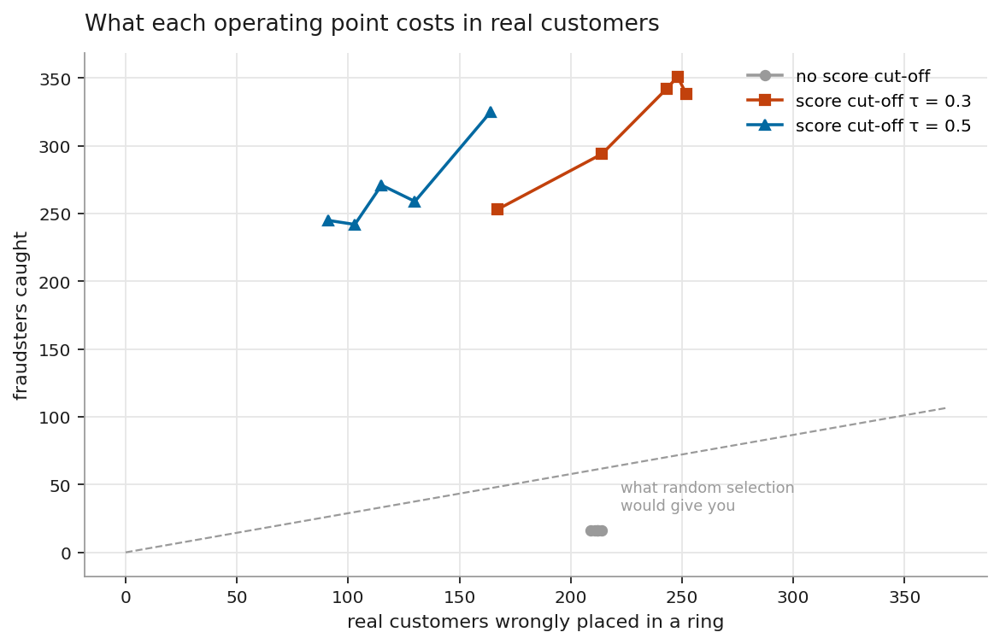
*Each point is one score cut-off (tau); the headline operating point is marked. Precision rises steeply then flattens as the cut-off tightens, while cost falls - the marked point is where that trade-off was judged worth making, not the only defensible choice.*

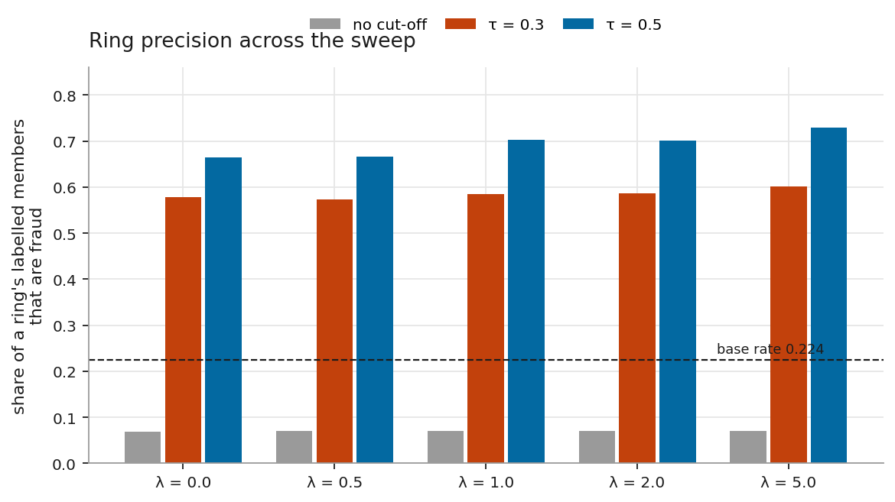
*Precision depends far more on the score cut-off than on how much the peeling objective weighs the model's opinion - most of the grid's variation runs along the tau axis, not the lambda axis.*

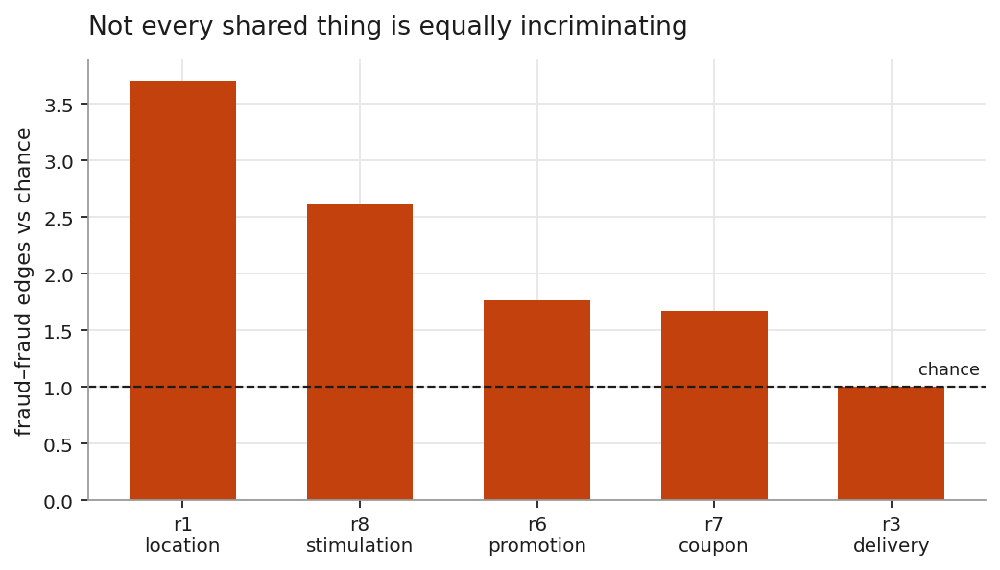
*The relation carrying the most edges (promotion) has the weakest evidential lift; the rarest relations are the strongest evidence per edge. Edge count and evidential value are not the same thing.*

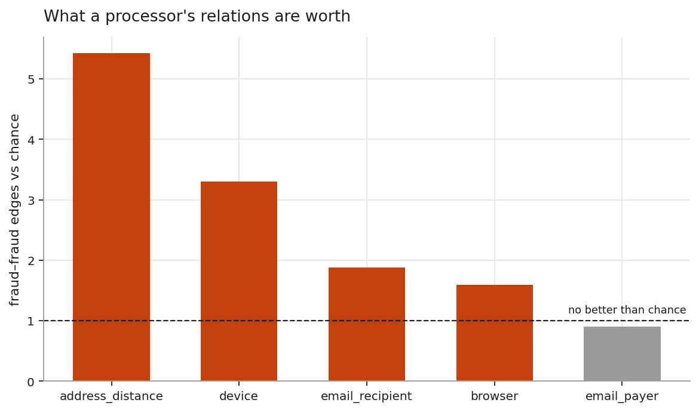
*The same lift-versus-share pattern as PPA, on a different dataset. address_distance is the same billing address and distance band; device the same device; email_recipient the same recipient e-mail domain; browser the same browser build; email_payer the same payer e-mail domain, the one relation no better than chance.*

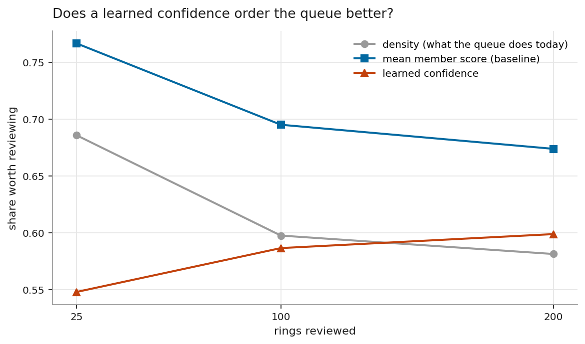
*Ranking rings by their members' mean account score beats both a trained ring-confidence model and raw density, at every depth tested - the simplest ranking wins here, not the most sophisticated one.*

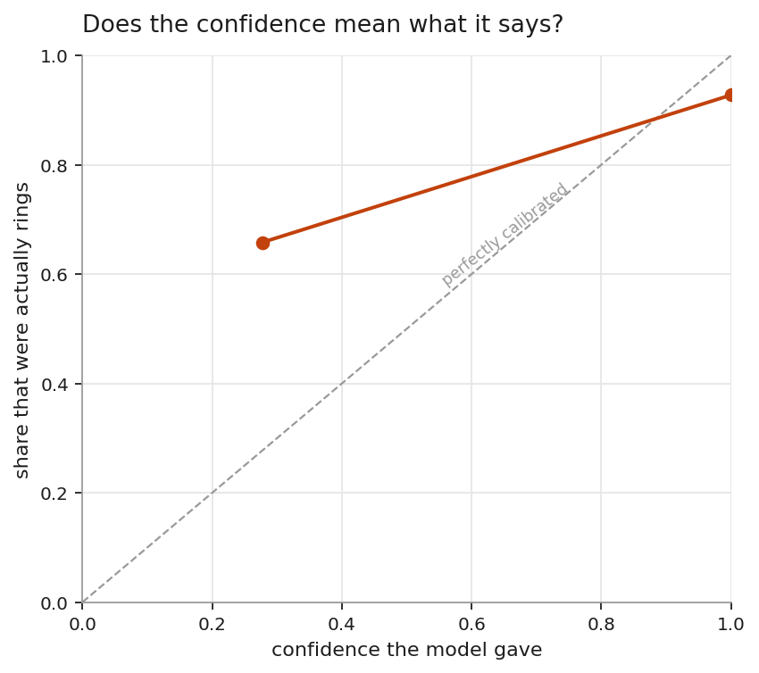
*Points near the diagonal mean the ring-confidence model's stated probability is trustworthy at that decile; points off it show where the model is over- or under-confident.*

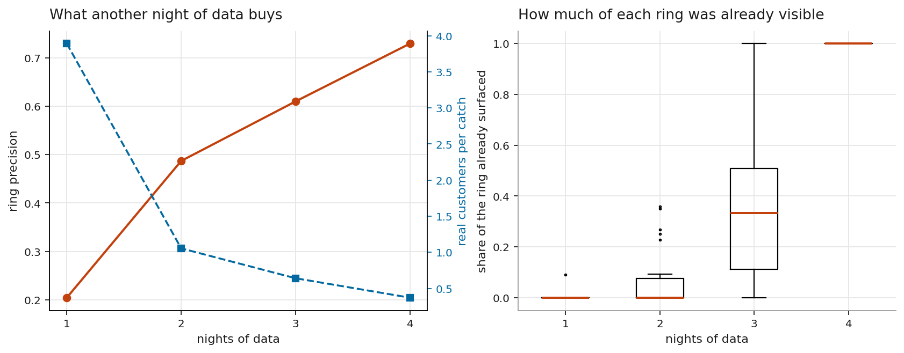
*One night of data lands at the base rate; it takes four nights of replay to reach the precision this project reports as its headline number, which is the real cost of not anchoring cases across nights.*

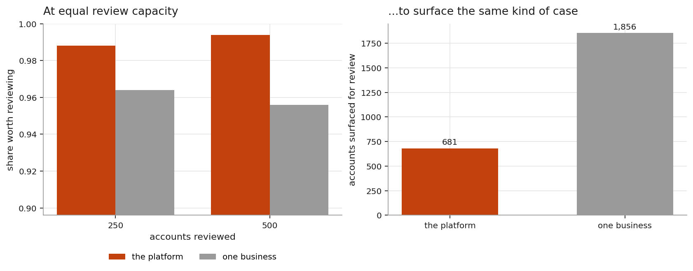
*Removing the cross-business relation costs both ring precision and account-scoring AUPRC - real, measured evidence for what an aggregator's view is worth, not an assumption.*

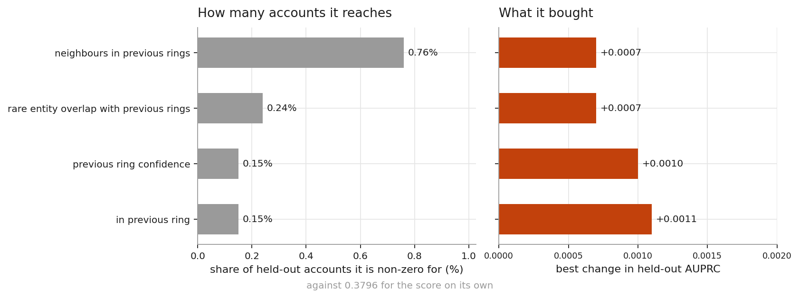
*The lift is small (+0.0011) because the feature is only ever non-zero for 0.15% of held-out accounts - most accounts were in no ring last window, so there is nothing for the feature to carry forward for them.*

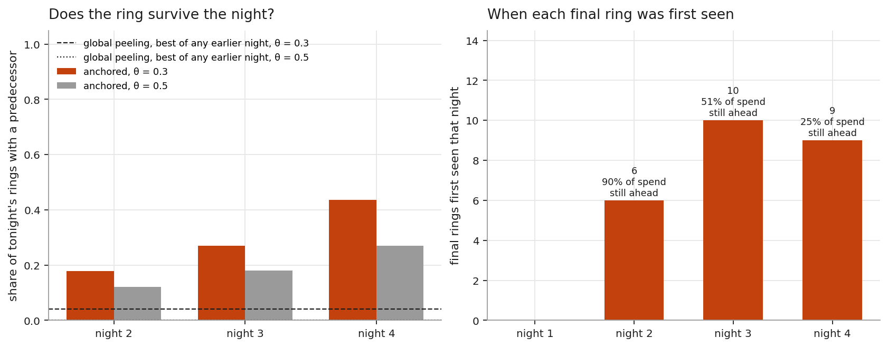
*Anchoring the extraction around fixed accounts is what makes a case trackable from one night to the next - global peeling recomposes the whole graph every night and loses almost every case in the process.*

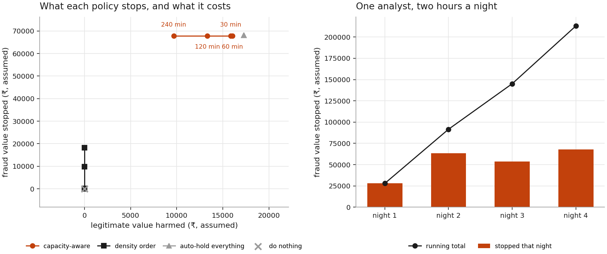
*Left: the capacity-aware policy holds fraud stopped roughly flat while cutting legitimate harm as the budget grows - more analyst time buys fewer wrongly-harmed customers, not more fraud caught. Right: an analyst working two hours a night keeps catching new fraud value every night of the replay, not just the first.*

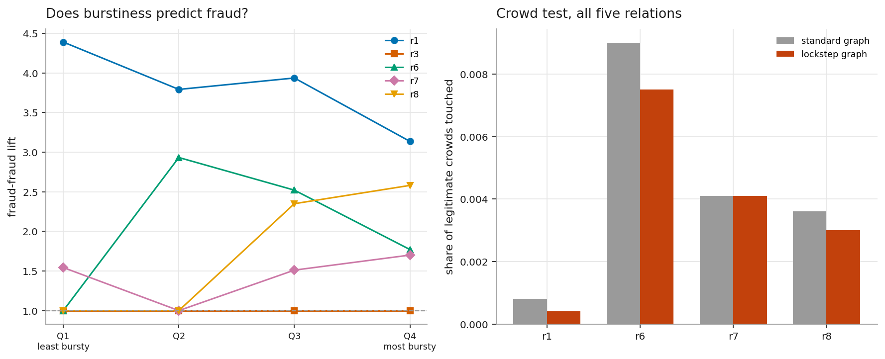
*Burst-weighting costs precision on PPA with no clean per-relation story, and leaves the IEEE-CIS apartment-cluster weakness exactly unchanged - a negative result, shown rather than omitted.*

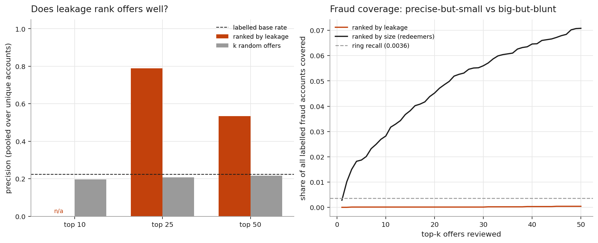
*Ranking offers by leakage is precise but narrow - it covers very little of all labelled fraud, because it puts small offers first. Ranking by raw size covers far more at a much larger review cost. Neither ranking dominates; which to use is a capacity decision.*

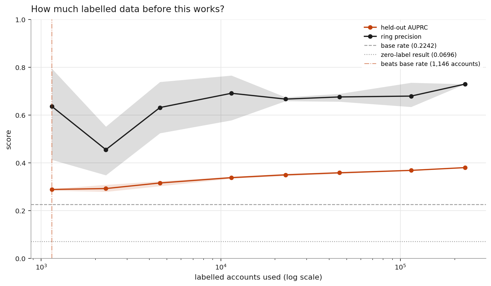
*Even the smallest label budget tested (1,146 accounts) already beats the base rate, and AUPRC keeps climbing all the way to full label availability with no plateau visible in the range tested.*

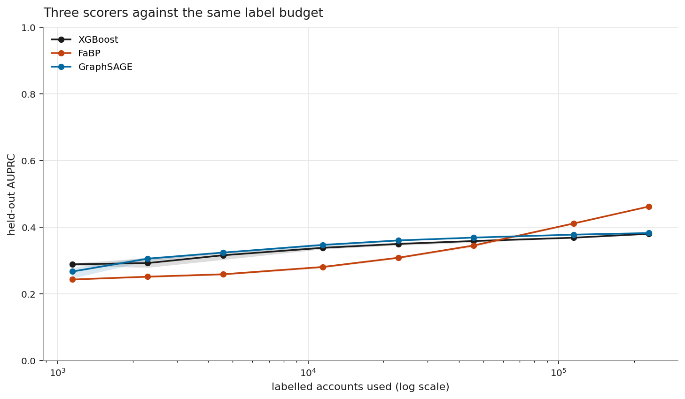
*Belief propagation trails both learned scorers until roughly half the training pool is labelled, then overtakes both - the crossover is real and the hypothesis going in predicted the opposite order.*

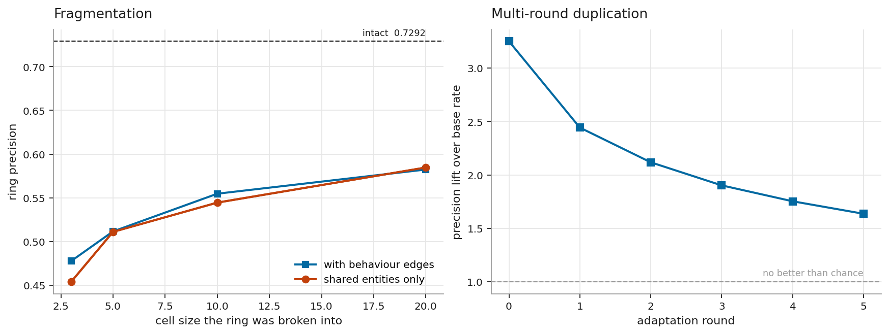
*Precision falls sharply as cells shrink; behavioural edges recover some of it at cells of three and recover nothing at cells of twenty - fragmentation remains the evasion that works.*
