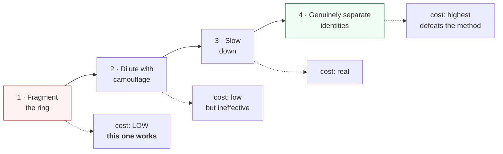

# Threat model

**[← README](../README.md)** · [Architecture](architecture.md) · [Design decisions](design-decisions.md) · [Results](results.md)

Orbweaver looks for **one operator behind many accounts**. Every order is
individually legitimate; the abuse exists only in the relationships.

The obvious way a system like this goes wrong is flagging people who simply
live together. Tested directly: of **2,446** co-located groups (sharing a
delivery location, labelled overwhelmingly normal), only **2 — 0.08%** have any
member placed in a ring.

## What it catches

| Abuse | Covered? |
|---|---|
| **New-user offer farming** — many accounts, one operator, first-order discounts | **Yes** — directly, this is what PPA labels |
| **Referral rings** — A "refers" B, C, D…, all controlled by A | **Yes** — same graph signature |
| **Cashback farming** — orders timed and shaped to milk cashback rules | **Yes** — labelled in PPA |
| **Stocking up / reseller rings** — discounted stock bought across accounts to resell | **Yes** — labelled in PPA |
| Seller-side collusion — a merchant placing fake orders from controlled accounts | Same algorithm, different labels — **not evaluated, so not claimed** |
| Delivery-partner collusion — riders and fake customers farming incentives | Same algorithm — not evaluated, so not claimed |
| Refund rings — coordinated "item not received" claims | Same algorithm — not evaluated, so not claimed |
| Money-mule networks — proceeds hopping between accounts | Same algorithm — not evaluated, so not claimed |

## What it does not catch

| Out of scope | Why |
|---|---|
| **A lone fraudster** | No graph signature, nothing to peel. A per-transaction scorer is the right tool — Orbweaver sits *downstream* of one, not in place of it |
| **Account takeover** | The account is a real customer with real history; the fraud is in the session, not the relationships |
| **Stolen cards, as a per-card problem** | Different mechanism: one card used by one person who shouldn't have it. What *does* transfer is when shared entities link the accounts using those cards — run unchanged on IEEE-CIS (device, e-mail domains, billing address, browser), the same extractor reaches **0.5079** ring precision at **18.14×** base rate. The boundary is the mechanism, not the payment domain |
| **Abuse with no shared entity at all** | A different address, device, promotion and coupon per account, never overlapping, leaves no edge to find. This is the honest boundary — and the one the adversarial evaluation probes |

## The adversary's cost ladder

| # | Evasion | Cost | What happens |
|---|---|---|---|
| 1 | **Fragment the ring** — split fifty accounts into ten cells of five sharing nothing across cells | **Low** | **The attack that works.** Density falls below detectability. Behavioural edges (accounts that behave alike still do so after every shared entity is cut) recover **+0.0237** precision at cells of three — but **nothing** at cells of twenty, and they don't restore the curve |
| 2 | **Dilute with camouflage** — add edges to ordinary accounts through common entities | Low | Ineffective. Rarity weighting makes an entity shared by 3M accounts worth almost nothing, so density barely moves. Camouflage through *rare* entities would work — but that means acquiring genuinely distinct addresses and instruments, which is exactly the cost we want to impose |
| 3 | **Slow down** — spread the same behaviour over a longer window | Real | Effective, and it directly reduces the attacker's return per unit time |
| 4 | **Genuinely separate identities** — different address, device, instrument, promotion per account | Highest | Defeats the method completely. It also removes most of the economic advantage of running a ring, which is the point: make the *cheap* version uneconomic, not make fraud impossible |

The useful output of the fragmentation evaluation is not "we catch everything"
— it is **"here is the cell size below which we do not."**

## Costs of being wrong

**A false positive is a group, not a person.** Acting on a wrong ring of forty
accounts means forty real customers at once. That is why every detection number
here is reported next to its false-positive count and cost, and why the output
is a **case file for review** rather than an automated action.

**Most likely false positive: a shared address.** In India that is routinely a
hostel, a PG, an office or a joint family. The hostel test is built
specifically on that population and reports both how many the pipeline touches
and what separates those it touches from those it leaves alone — the separator
turns out to be the *account score*, not the structure.

**Most likely false negative: a small, careful ring.** Below the size floor, or
spread across enough distinct entities, a group leaves no dense structure.
Lowering the floor to catch it raises false positives on ordinary small groups
like families. That trade-off is a business decision about review capacity and
customer harm, not a modelling one — which is why the operating point is
reported as a **curve** rather than chosen here.

---

**[← README](../README.md)** · Next: [the honest failure log →](../FAILURES.md)
